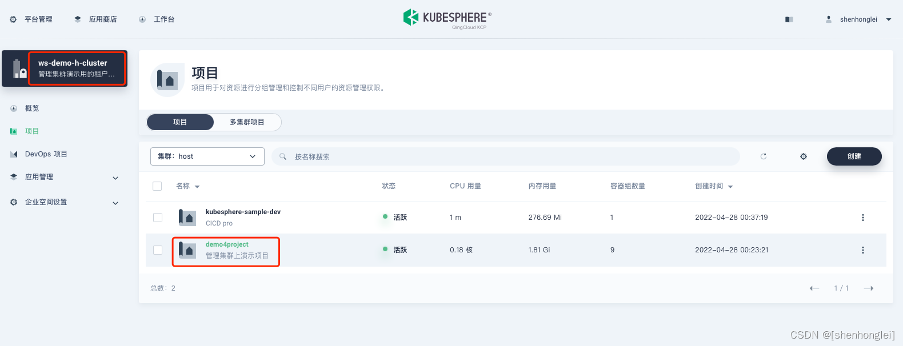
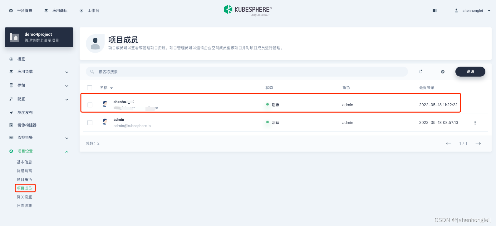
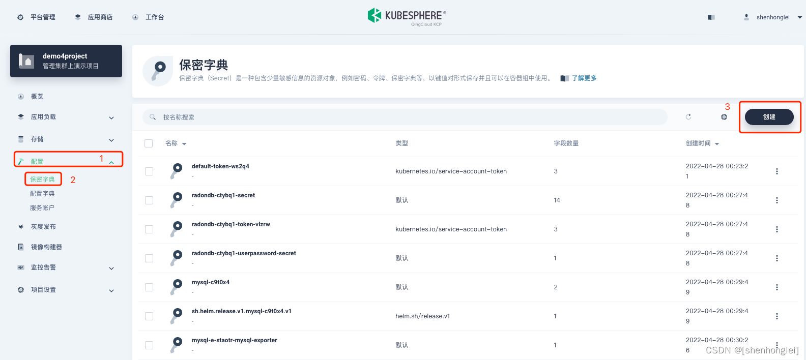
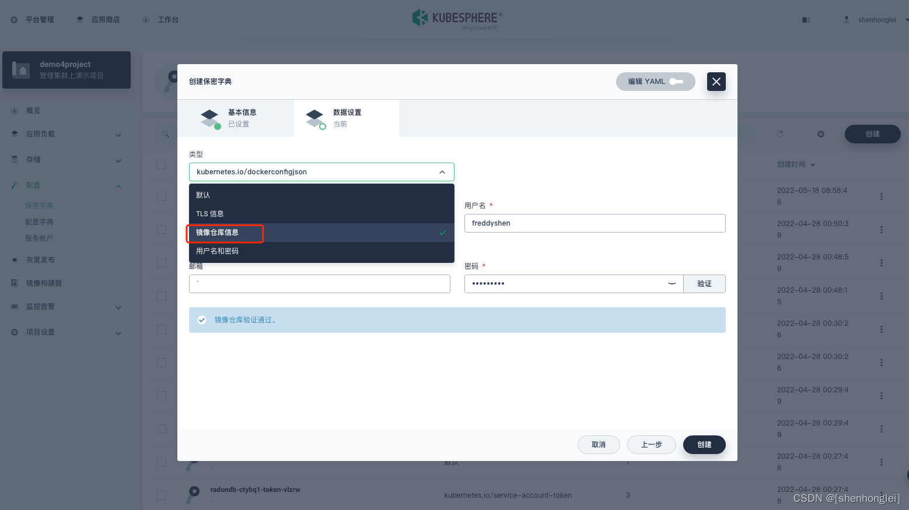
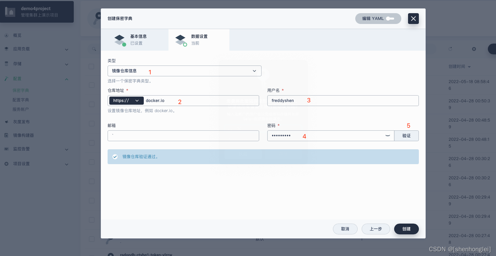

# kubesphere实现流水线部署

## 一、安装[kubekey](https://github.com/kubesphere/kubekey)

```sh
#解压
tar -zxf kubekey-v3.1.2-linux-amd64.tar.gz
#将解压出来的KK放到/usr/bin
mv kk /usr/bin
#安装时间同步
apt install ntpdate
```

## 二、安装k8s和kubesphere

### 1、单集群

```sh
#这是单个集群安装的
kk create cluster --with-kubernetes v1.26 --container-manager containerd --with-kubesphere v3.4.0
```

> 注意：版本大于1.18一定要安装：apt install socat和apt install conntrack  所有节点都安装,同时在所有节点上都运行：export KKZONE=cn

### 1.1、关闭swap分区

```sh
swapoff -a && sed -ri 's/.*swap.*/#&/' /etc/fstab
```

### 2、多集群

```sh
#下载配置文件
./kk create config --with-kubesphere [version]
```

### 2.1、配置文件:config-sample.yaml

```yaml

apiVersion: kubekey.kubesphere.io/v1alpha2
kind: Cluster
metadata:
  name: sample
spec:
  hosts:
  - {name: master, address: 192.168.128.218, internalAddress: 192.168.128.218, user: root, password: "Aa135246"} #控制节点
  - {name: node01, address: 192.168.128.219, internalAddress: 192.168.128.219, user: root, password: "Aa135246"} #工作节点
  - {name: node02, address: 192.168.128.220, internalAddress: 192.168.128.220, user: root, password: "Aa135246"} #工作节点
  roleGroups:
    etcd:
    - master
    control-plane:
    - master
    worker:
    - node01
    - node02
  controlPlaneEndpoint:
    ## Internal loadbalancer for apiservers
    # internalLoadbalancer: haproxy

    domain: lb.kubesphere.local
    address: ""
    port: 6443
  kubernetes:
    version: v1.26.5 #k8s版本
    clusterName: cluster.local
    autoRenewCerts: true
    containerManager: docker
  etcd:
    type: kubekey
  network:
    plugin: calico
    kubePodsCIDR: 10.233.64.0/18
    kubeServiceCIDR: 10.233.0.0/18
    ## multus support. https://github.com/k8snetworkplumbingwg/multus-cni
    multusCNI:
      enabled: false
  registry:
    privateRegistry: ""
    namespaceOverride: ""
    registryMirrors: []
    insecureRegistries: []
    #---只显示一部分
```

### 2.2、执行安装命令：

```sh
./kk create cluster -f config-sample.yaml
```

### 2.3、控制节点配置：

```sh
Your Kubernetes control-plane has initialized successfully!

To start using your cluster, you need to run the following as a regular user:

  mkdir -p $HOME/.kube
  sudo cp -i /etc/kubernetes/admin.conf $HOME/.kube/config
  sudo chown $(id -u):$(id -g) $HOME/.kube/config

Alternatively, if you are the root user, you can run:

  export KUBECONFIG=/etc/kubernetes/admin.conf

You should now deploy a pod network to the cluster.
Run "kubectl apply -f [podnetwork].yaml" with one of the options listed at:
  https://kubernetes.io/docs/concepts/cluster-administration/addons/

You can now join any number of control-plane nodes by copying certificate authorities
and service account keys on each node and then running the following as root:

  kubeadm join lb.kubesphere.local:6443 --token qia5c7.cwtiagpza4lckibi \
        --discovery-token-ca-cert-hash sha256:04f5f1c3a9367c970ae32776561674bdb62950cca8596fe5fca1dabb75152d25 \
        --control-plane

Then you can join any number of worker nodes by running the following on each as root:

kubeadm join lb.kubesphere.local:6443 --token qia5c7.cwtiagpza4lckibi \
        --discovery-token-ca-cert-hash sha256:04f5f1c3a9367c970ae32776561674bdb62950cca8596fe5fca1dabb75152d25

```

### 2.4、安装成功日志

```sh
namespace/kubesphere-system unchanged
serviceaccount/ks-installer unchanged
customresourcedefinition.apiextensions.k8s.io/clusterconfigurations.installer.kubesphere.io unchanged
clusterrole.rbac.authorization.k8s.io/ks-installer unchanged
clusterrolebinding.rbac.authorization.k8s.io/ks-installer unchanged
deployment.apps/ks-installer unchanged
clusterconfiguration.installer.kubesphere.io/ks-installer created
22:41:33 CST success: [master]
#####################################################
###              Welcome to KubeSphere!           ###
#####################################################

Console: http://192.168.128.218:30880
Account: admin
Password: P@88w0rd 修改为：HZWX62352744aa??aa
NOTES：
  1. After you log into the console, please check the
     monitoring status of service components in
     "Cluster Management". If any service is not
     ready, please wait patiently until all components
     are up and running.
  2. Please change the default password after login.

#####################################################
https://kubesphere.io             2024-07-11 22:56:50
#####################################################
22:56:54 CST success: [master]
22:56:54 CST Pipeline[CreateClusterPipeline] execute successfully
Installation is complete.

Please check the result using the command:

        kubectl logs -n kubesphere-system $(kubectl get pod -n kubesphere-system -l 'app in (ks-install, ks-installer)' -o jsonpath='{.items[0].metadata.name}') -f

```

## 三、pod操作

### 3.1、强制删除pod

```sh
kubectl delete pod ks-apiserver-6485fd9665-vn52k  -n kubesphere-system --grace-period=0 --force
```

### 3.2、查看所有pod

```sh
kubectl get pods --all-namespaces
```

## 四、kubesphere相关基础配置

### 4.1、配置镜像拉取和推送镜像到

路径:/etc/docker/daemon.json 如果没有这个文件就新建，需要在所有节点上设置

```json
{
  // 日志选项配置
  "log-opts": {
    // 单个日志文件的最大大小为5MB，达到此大小时，日志文件将会被轮转
    "max-size": "5m",
    
    // 系统最多保留3个轮转后的日志文件
    "max-file": "3"
  },

  // 执行选项配置
  "exec-opts": [
    // 使用systemd作为cgroup驱动程序
    "native.cgroupdriver=systemd"
  ],

  // 不安全的私有镜像仓库地址
  "insecure-registries": [
    // 配置不安全的镜像仓库地址，允许从该地址拉取镜像而不进行SSL验证
    "192.168.1.166:80"
  ],

  // 镜像加速器配置
  "registry-mirrors": [
    // 配置镜像加速器地址，从该地址拉取镜像时速度会更快
    "https://cf-workers-docker-io-784.pages.dev"
  ]
}
```

### 4.2、重启docker

重载守护进程，以便它读取新的配置：

```sh
sudo systemctl daemon-reload
```

重启Docker服务使新的配置生效：

```sh
sudo systemctl restart docker
```

验证Docker是否正常运行

```sh
sudo systemctl status docker
```

### 4.3、kubesphere配置私有镜像仓库

#### 1.1 准备工作

您需要创建一个企业空间、一个项目和一个用户（例如 demo4project）。该用户必须已邀请至该项目，并具有 operator 角色




#### 1.2 创建保密字典

创建工作负载、服务、任务或定时任务时，除了从公共仓库选择镜像，您还可以从私有仓库选择镜像。要使用私有仓库中的镜像，您必须先为私有仓库创建保密字典，以便在 KubeSphere 中集成该私有仓库。

#### 1.2.1 步骤 1：进入保密字典页面

以 demo4project 用户登录 KubeSphere Web 控制台并进入项目，在左侧导航栏中选择配置下的保密字典，然后点击创建。



#### 1.2.2 步骤 2：配置基本信息

设置保密字典的名称（例如 dockerhub），然后点击下一步。

> 您可以在对话框右上角启用编辑 YAML 来查看保密字典的 YAML 清单文件，并通过直接编辑清单文件来创建保密字典。您也可以继续执行后续步骤在控制台上创建保密字典。



#### 1.2.3 步骤 3：配置镜像仓库信息

将类型设置为 镜像仓库信息。要在创建应用负载时使用私有仓库中的镜像，您需要配置以下字段：

仓库地址：镜像仓库的地址，其中包含创建应用负载时需要使用的镜像。
用户名：登录镜像仓库所需的用户名。
密码：登录镜像仓库所需的密码。
邮箱（可选）：您的邮箱地址。



#### 1.2.3.1 添加 Docker Hub 仓库

在 Docker Hub 上添加镜像仓库之前，您需要注册一个 Docker Hub 帐户。在保密字典设置页面，将仓库地址设置为 docker.io，将用户名和密码分别设置为您的 Docker ID 和密码，然后点击验证以检查地址是否可用。

点击创建。保密字典创建后会显示在保密字典界面。

#### 1.2.3.2 添加 Harbor 镜像仓库

Harbor 是一个开源的可信云原生仓库项目，用于对内容进行存储、签名和扫描。通过增加用户经常需要的功能，例如安全、身份验证和管理，Harbor 扩展了开源的 Docker Distribution。Harbor 使用 HTTP 和 HTTPS 为仓库请求提供服务。

#### HTTP

您需要修改集群中所有节点的 Docker 配置。例如，如果外部 Harbor 仓库的 IP 地址为 http://192.168.0.99，您需要在 /etc/systemd/system/docker.service.d/docker-options.conf 文件中增加 --insecure-registry=192.168.0.99 标签。

```sh
[Service]
Environment="DOCKER_OPTS=--registry-mirror=https://registry.docker-cn.com --insecure-registry=10.233.0.0/18 --data-root=/var/lib/docker --log-opt max-size=50m --log-opt max-file=5 \
--insecure-registry=192.168.0.99"
```

> 请将镜像仓库的地址替换成实际的地址。
有关 Environment 字段中的标签，请参阅 Dockerd Options。
Docker 守护进程需要 --insecure-registry 标签才能与不安全的仓库通信。有关该标签的更多信息，请参阅 Docker 官方文档。

2、重新加载配置文件并重启 Docker。

```sh
 sudo systemctl daemon-reload
```

```sh
sudo systemctl restart docker
```

3、在 KubeSphere 控制台上进入创建保密字典的数据设置页面，将类型设置为镜像仓库信息，将仓库地址设置为您的 Harbor IP 地址，并设置用户名和密码。

> 如需使用 Harbor 域名而非 IP 地址，您需要在集群中配置 CoreDNS 和 nodelocaldns。
下一篇文章中会介绍，如何集成使用Harobr域名的镜像仓库

4、点击创建。保密字典创建后会显示在保密字典页面。有关保密字典创建后如何编辑保密字典。

#### HTTPS

有关如何集成基于 HTTPS 的 Harbor 仓库，请参阅 Harbor 官方文档。请确保您已使用 docker login 命令连接到您的 Harbor 仓库。

#### 1.3 使用镜像仓库

如果您已提前创建了私有镜像仓库的保密字典，您可以选择私有镜像仓库中的镜像。例如，创建部署时，您可以在添加容器页面点击镜像下拉列表选择一个仓库，然后输入镜像名称和标签使用镜像。

#### 1.4 快速部署 Harbor v2.3.1 https 访问

[https 访问-快速部署 Harbor v2.3.1](https://shenhonglei.blog.csdn.net/article/details/124183802)

## 五、流水线安装

### 1、流水线代码

```groovy
pipeline {
    agent {
        node {
            label 'mavenjdk21'
        }
    }

    environment {
        // Harbor 凭证 ID(登录您的 Harbor)
        DOCKER_CREDENTIAL_ID = 'harbor-id'
        // GitLab 凭证 ID (推送 tag 到 GitLab 仓库)
        GITHUB_CREDENTIAL_ID = 'git'
        // Kubeconfig 凭证 ID (访问接入正在运行的 Kubernetes 集群)
        KUBECONFIG_CREDENTIAL_ID = 'tg-kubeconfig'
        // 镜像的推送地址
        HARBOR_REGISTRY = '192.168.128.166:80'
        // Harbor 账号名
        DOCKERHUB_NAMESPACE = 'robot$tg'
        //仓库名称
        HARBOR_NAME = 'tgtestprod'
        //创建命名空间
        KUBE_NAMESPACE = 'tg-test'
        //源码地址
        GIT_URL = 'http://192.168.127.142/root/tg.git'
    }

    parameters {
        // 添加分支选择参数
         choice(name: 'BRANCH_NAME', choices: ['develop', 'master'], description: '选择要构建的分支')
          //string(name: 'TAG_NAME', defaultValue: '', description: '选择标签')
    }

    stages {
        stage('检出') {
            steps {
                container('maven') {
                    git(url: "$GIT_URL", credentialsId: "$GITHUB_CREDENTIAL_ID", branch: "$BRANCH_NAME", changelog: true, poll: false)
                    sh 'ls -l'
                }
            }
        }

        stage('编译打包') {
            steps {
                container('maven') {
                    sh 'mvn clean package -Dmaven.test.skip=true'
                }
            }
        }

        stage('构建镜像') {
            parallel {
                stage('构建tg-test镜像') {
                    steps {
                        container('maven') {
                            sh 'docker build -t yudao-server:latest -f yudao-server/Dockerfile yudao-server/'
                        }
                    }
                }
            }
        }

        stage('推送镜像到仓库') {
            parallel {
                stage('推送tg-server镜像到harbor') {
                    steps {
                        container('maven') {
                            withCredentials([usernamePassword(credentialsId: "$DOCKER_CREDENTIAL_ID", passwordVariable: 'HARBOR_PWD_VAR', usernameVariable: 'HARBOR_USER_VAR')]) {
                                sh 'echo "$HARBOR_PWD_VAR" | docker login -u $HARBOR_USER_VAR --password-stdin $HARBOR_REGISTRY'
                                sh 'docker tag yudao-server:latest $HARBOR_REGISTRY/$HARBOR_NAME/tg-server:latest'
                                sh 'docker push $HARBOR_REGISTRY/$HARBOR_NAME/tg-server:latest'
                            }
                        }
                    }
                }
            }
        }
        stage('推送到K8S环境') {
             steps {
                   container('tg-kubeconfig') {
                       withCredentials([kubeconfigFile(credentialsId: env.KUBECONFIG_CREDENTIAL_ID, variable: 'KUBECONFIG')]) {
                           // 确保 kubectl 命令在 PATH 中
                           sh "export PATH=/usr/local/bin:$PATH"
    
                           // 设置 kubectl 权限
                           sh 'chmod +x /usr/local/bin/kubectl'
    
                           // 检查 kubectl 是否可用
                           sh 'which kubectl'
    
                           // 替换占位符并将结果保存到临时文件
                           sh 'envsubst < script/devops/deploy/deploy.yml | kubectl apply -f -'
                       }
                   }
             }
        }
    }

    post {
        always {
            cleanWs()
        }
        success {
            echo 'Pipeline completed successfully'
        }
        failure {
            echo 'Pipeline failed'
        }
    }
}

```