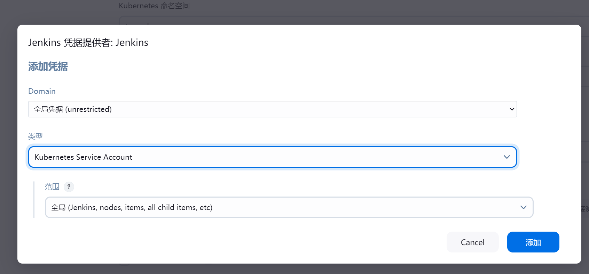
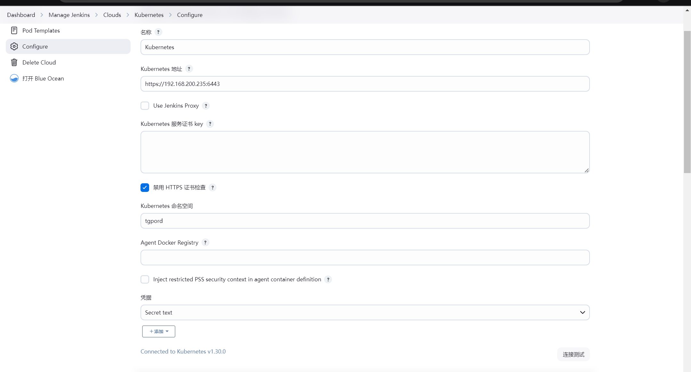

# 项目实现jenkins+K8S部署

## 一、安装[kubekey](https://github.com/kubesphere/kubekey)

```sh
#解压
tar -zxf kubekey-v3.1.2-linux-amd64.tar.gz
#将解压出来的KK放到/usr/bin
mv kk /usr/bin
#安装时间同步
apt install ntpdate
```

## 二、安装k8s和kubesphere

### 1、单集群

```sh
#这是单个集群安装的
kk create cluster --with-kubernetes v1.26 --container-manager containerd --with-kubesphere v3.4.0
```

> 注意：版本大于1.18一定要安装：apt install socat和apt install conntrack  所有节点都安装,同时在所有节点上都运行：export KKZONE=cn

### 1.1、关闭swap分区

```sh
swapoff -a && sed -ri 's/.*swap.*/#&/' /etc/fstab
```

### 2、多集群

```sh
#下载配置文件
./kk create config --with-kubesphere [version]
```

### 2.1、配置文件:config-sample.yaml

```yaml
apiVersion: kubekey.kubesphere.io/v1alpha2
kind: Cluster
metadata:
  name: sample
spec:
  hosts:
  - {name: master, address: 192.168.1.235, internalAddress: 192.168.1.235, user: root, password: "xxxxx"}
  - {name: node01, address: 192.168.1.236, internalAddress: 192.168.1.236, user: root, password: "xxxxx"}
  - {name: node02, address: 192.168.1.237, internalAddress: 192.168.1.237, user: root, password: "xxxxx"}
  roleGroups:
    etcd:
    - master
    control-plane:
    - master
    worker:
    - node01
    - node02
  controlPlaneEndpoint:
    ## Internal loadbalancer for apiservers
    # internalLoadbalancer: haproxy

    domain: lb.kubesphere.local
    address: ""
    port: 6443
  kubernetes:
    version: v1.30.0
    clusterName: cluster.local
    autoRenewCerts: true
    containerManager: docker
  containerRuntime:
    docker:
      version: 26.1.4
  etcd:
    type: kubekey
  network:
    plugin: calico
    kubePodsCIDR: 10.233.64.0/18
    kubeServiceCIDR: 10.233.0.0/18
    ## multus support. https://github.com/k8snetworkplumbingwg/multus-cni
    multusCNI:
      enabled: false
  registry:
    privateRegistry: ""
    namespaceOverride: ""
    registryMirrors: []
    insecureRegistries: []
  addons:
    - name: nfs-client
      namespace: kube-system
      sources:
        chart:
          name: nfs-client-provisioner
          repo: https://charts.kubesphere.io/main
          valuesFile: /root/values.yaml

```

### 2.2、执行安装命令：

```sh
./kk create cluster -f config-sample.yaml
```

### 2.3、控制节点配置：

```sh

Your Kubernetes control-plane has initialized successfully!

To start using your cluster, you need to run the following as a regular user:

  mkdir -p $HOME/.kube
  sudo cp -i /etc/kubernetes/admin.conf $HOME/.kube/config
  sudo chown $(id -u):$(id -g) $HOME/.kube/config

Alternatively, if you are the root user, you can run:

  export KUBECONFIG=/etc/kubernetes/admin.conf

You should now deploy a pod network to the cluster.
Run "kubectl apply -f [podnetwork].yaml" with one of the options listed at:
  https://kubernetes.io/docs/concepts/cluster-administration/addons/

You can now join any number of control-plane nodes by copying certificate authorities
and service account keys on each node and then running the following as root:

  kubeadm join lb.kubesphere.local:6443 --token 3ph0wq.hq47dw7m73a1mr6q \
        --discovery-token-ca-cert-hash sha256:1da916bb93cec463d1aa2de71da9ca6e984df8f74517e59ff4fa9b1a9407ab6c \
        --control-plane

Then you can join any number of worker nodes by running the following on each as root:

kubeadm join lb.kubesphere.local:6443 --token 3ph0wq.hq47dw7m73a1mr6q \
        --discovery-token-ca-cert-hash sha256:1da916bb93cec463d1aa2de71da9ca6e984df8f74517e59ff4fa9b1a9407ab6c

```

### 2.4、安装成功日志

```sh
namespace/kubesphere-system unchanged
serviceaccount/ks-installer unchanged
customresourcedefinition.apiextensions.k8s.io/clusterconfigurations.installer.kubesphere.io unchanged
clusterrole.rbac.authorization.k8s.io/ks-installer unchanged
clusterrolebinding.rbac.authorization.k8s.io/ks-installer unchanged
deployment.apps/ks-installer unchanged
clusterconfiguration.installer.kubesphere.io/ks-installer created
22:41:33 CST success: [master]
#####################################################
###              Welcome to KubeSphere!           ###
#####################################################

Console: http://192.168.1.239:30880
Account: admin
Password: P@88w0rd 修改为：xxxxxx
NOTES：
  1. After you log into the console, please check the
     monitoring status of service components in
     "Cluster Management". If any service is not
     ready, please wait patiently until all components
     are up and running.
  2. Please change the default password after login.

#####################################################
https://kubesphere.io             2024-07-11 22:56:50
#####################################################
22:56:54 CST success: [master]
22:56:54 CST Pipeline[CreateClusterPipeline] execute successfully
Installation is complete.

Please check the result using the command:

        kubectl logs -n kubesphere-system $(kubectl get pod -n kubesphere-system -l 'app in (ks-install, ks-installer)' -o jsonpath='{.items[0].metadata.name}') -f

```

## 3、pod操作

### 3.1、强制删除pod

```sh
kubectl delete pod ks-apiserver-6485fd9665-vn52k  -n kubesphere-system --grace-period=0 --force
```

#### 3.2、查看所有pod

```sh
kubectl get pods --all-namespaces
```

#### 3.3、创建 NFS Provisioner 配置文件

```yaml
nfs:
  server: 192.168.1.238  # 你的NFS服务器地址
  path: /root/nfs  # NFS服务器上导出的路径

storageClass:
  name: nfs-client
  defaultClass: true  # 将NFS设为默认的StorageClass
```

## 三、流水线安装

### 1、自动化部署(后端部署)

### 1.1、流水线代码

```groovy
pipeline {
    agent any

    environment {
        harborUser = 'admin'
        harborPasswd = 'xxxxxx'
        harborAddress = '192.168.1.239:30002'
        harborRepo = 'tgprod'
        kubeNamespace = 'tgpord'
        chartName = 'tg-server'
    }
    stages {
        stage('检出') {
            steps {
                checkout scmGit(branches: [[name: '${tag}']], extensions: [], userRemoteConfigs: [[credentialsId: '5e3afd73-6581-4e14-8bd4-f17e3f353270', url: 'http://192.168.1.232/root/tg.git']])
            }
        }
        stage('项目构建') {
            steps {
                sh '/var/jenkins_home/maven-3.9.9/bin/mvn clean package -Dmaven.test.skip=true'
            }
        }
        stage('SonarQube代码质量分析') {
            steps {
                sh '/var/jenkins_home/sonar-scanner/bin/sonar-scanner  -Dsonar.source=./  -Dsonar.projectname=${JOB_NAME}  -Dsonar.projectKey=${JOB_NAME}  -Dsonar.java.binaries=/var/jenkins_home/workspace/tg-k8s/yudao-server/target  -Dsonar.login=8ee03618a249aa7c14ab664cf85f0e7627256306'
            }
        }
        stage('docker镜像构建') {
            steps {
                sh '''mv /var/jenkins_home/workspace/tg-k8s/yudao-server/target/*.jar ./yudao-server/
                         docker build -t tg-server:${tag} /var/jenkins_home/workspace/tg-k8s/yudao-server'''
            }
        }
        stage('推送镜像至镜像仓库') {
            steps {
                sh '''docker login -u ${harborUser} -p ${harborPasswd} ${harborAddress}
                      docker tag tg-server:${tag} ${harborAddress}/${harborRepo}/tg-server:${tag}
                      docker push ${harborAddress}/${harborRepo}/tg-server:${tag}'''
            }
        }
        stage('打包helm chart') {
            steps {
                sh '''cd /var/jenkins_home/workspace/tg-k8s/script/k8s/tg-server
                         helm package . --version ${chartTag} --app-version ${tag}'''
            }
        }
        stage('通知k8s集群部署') {
            steps {
                script {
                    sh '''
                    helm upgrade --install tg-server /var/jenkins_home/workspace/tg-k8s/script/k8s/tg-server/tg-server-${chartTag}.tgz \
                        --set image.repository=${harborAddress}/${harborRepo}/tg-server \
                        --set image.tag=${tag} \
                        --namespace ${kubeNamespace} \
                        --values /var/jenkins_home/workspace/tg-k8s/script/k8s/tg-server/values.yaml
                    '''
                }
            }
        }
    }
    post {
        success {
            dingtalk(
                    robot: 'tg-k8s',
                    type: 'MARKDOWN',
                    title: "success: ${JOB_NAME}",
                    text: ["- 成功构建:${JOB_NAME}项目!\n- 版本:${tag}\n- 持续时间:${currentBuild.durationString}\n- 任务:#${JOB_NAME}"]
            )
        }
        failure {
            dingtalk(
                    robot: 'tg-k8s',
                    type: 'MARKDOWN',
                    title: "fail: ${JOB_NAME}",
                    text: ["- 失败构建:${JOB_NAME}项目!\n- 版本:${tag}\n- 持续时间:${currentBuild.durationString}\n- 任务:#${JOB_NAME}"]
            )
        }
    }
}
```

### 1.2、后端采用helm部署，部署的chart代码如下：

Chart.yaml

```yaml
apiVersion: v2

name: tg-server

description: A Helm chart for Kubernetes

type: application

version: 0.1.0 #chart版本

appVersion: "1.0.0" #应用版本
```

values.yaml

```yaml
replicaCount: 3  # 副本数量，决定了有多少个 Pod 会同时运行该应用

image:
  repository: 192.168.1.239:30002/tgtestprod/tg-server  # 镜像仓库地址，指定从哪里拉取镜像
  pullPolicy: Always  # 镜像拉取策略，`Always` 表示每次都会尝试拉取镜像
  tag: "latest"  # 镜像的标签，默认是 `latest`，可以在部署时通过 --set 覆盖

service:
  type: ClusterIP  # 服务类型，`ClusterIP` 表示仅集群内部可以访问该服务
  port: 48080  # 服务的端口，应用将通过此端口暴露

resources:
  limits:
    cpu: 2000m  # CPU 限制，最大可用 2 核 CPU
    memory: 2048Mi  # 内存限制，最大可使用 2048Mi 的内存

livenessProbe:  # 存活探针，用于检测应用是否存活
  path: /actuator/health  # 探测路径，通过该路径检测应用是否存活
  port: 48080  # 探测的端口
  initialDelaySeconds: 60  # 初始延迟 60 秒后开始探测，避免启动时探测失败
  timeoutSeconds: 1  # 探测超时时间，1 秒
  periodSeconds: 30  # 每 30 秒探测一次
  successThreshold: 1  # 成功探测的次数
  failureThreshold: 3  # 失败探测超过 3 次后，认为 Pod 已不可用并重启

readinessProbe:  # 就绪探针，用于检测应用是否准备好接收流量
  path: /actuator/health  # 探测路径，通过该路径检测应用是否准备好
  port: 48080  # 探测的端口
  initialDelaySeconds: 60  # 初始延迟 60 秒后开始探测，确保应用完全启动
  timeoutSeconds: 1  # 探测超时时间，1 秒
  periodSeconds: 60  # 每 60 秒探测一次
  successThreshold: 1  # 成功探测的次数
  failureThreshold: 3  # 失败探测超过 3 次后，认为 Pod 暂时不可用
```

deployment.yaml

```yaml
apiVersion: apps/v1  # 定义API版本，指定使用apps/v1，适用于Deployment资源
kind: Deployment  # 指定资源类型为Deployment
metadata:
  name: {{ .Chart.Name }}  # Deployment的名称，使用Chart的名称
  labels:  # 定义标签
    app: {{ .Chart.Name }}  # 应用程序的标签，便于选择和管理

spec:  # 定义Deployment的规格
  replicas: {{ .Values.replicaCount }}  # 指定要运行的Pod副本数
  selector:  # 用于选择管理的Pods的标签选择器
    matchLabels:
      app: {{ .Chart.Name }}  # 匹配标签，以识别该Deployment所管理的Pods
  strategy:  # 更新策略
    type: RollingUpdate  # 指定滚动更新的策略
    rollingUpdate:  # 定义滚动更新的参数
      maxSurge: 50%  # 允许超出期望副本数的最大数量（可以同时启动的额外副本数量）
      maxUnavailable: 50%  # 允许不可用的副本数（可以同时关闭的副本数量）
  template:  # 定义Pod模板
    metadata:
      labels:
        app: {{ .Chart.Name }}  # Pod的标签，与Deployment中的选择器匹配
    spec:  # Pod的规格
      containers:  # 定义容器
        - name: app  # 容器名称
          image: "{{ .Values.image.repository }}:{{ .Values.image.tag }}"  # 容器镜像，使用Values中的repository和tag
          imagePullPolicy: {{ .Values.image.pullPolicy }}  # 镜像拉取策略，从Values中获取
          ports:  # 容器暴露的端口
            - containerPort: {{ .Values.service.port }}  # 容器端口，使用Values中的port
              protocol: TCP  # 使用的协议
          resources:  # 资源限制
            limits:  # 定义资源限制
              cpu: {{ .Values.resources.limits.cpu }}  # CPU限制
              memory: {{ .Values.resources.limits.memory }}  # 内存限制
          livenessProbe:  # 存活探针
            httpGet:  # 使用HTTP GET请求检查存活状态
              path: {{ .Values.livenessProbe.path }}  # 检查的路径
              port: {{ .Values.livenessProbe.port }}  # 检查的端口
            initialDelaySeconds: {{ .Values.livenessProbe.initialDelaySeconds }}  # 初始延迟秒数
            timeoutSeconds: {{ .Values.livenessProbe.timeoutSeconds }}  # 超时时间（秒）
            periodSeconds: {{ .Values.livenessProbe.periodSeconds }}  # 检查频率（秒）
            successThreshold: {{ .Values.livenessProbe.successThreshold }}  # 成功阈值
            failureThreshold: {{ .Values.livenessProbe.failureThreshold }}  # 失败阈值
          readinessProbe:  # 就绪探针
            httpGet:  # 使用HTTP GET请求检查就绪状态
              path: {{ .Values.readinessProbe.path }}  # 检查的路径
              port: {{ .Values.readinessProbe.port }}  # 检查的端口
            initialDelaySeconds: {{ .Values.readinessProbe.initialDelaySeconds }}  # 初始延迟秒数
            timeoutSeconds: {{ .Values.readinessProbe.timeoutSeconds }}  # 超时时间（秒）
            periodSeconds: {{ .Values.readinessProbe.periodSeconds }}  # 检查频率（秒）
            successThreshold: {{ .Values.readinessProbe.successThreshold }}  # 成功阈值
            failureThreshold: {{ .Values.readinessProbe.failureThreshold }}  # 失败阈值

```

service.yaml

```yaml
apiVersion: v1
kind: Service
metadata:
  name: {{ .Chart.Name }}
  labels:
    app: {{ .Chart.Name }}
spec:
  type: {{ .Values.service.type }}
  ports:
    - port: {{ .Values.service.port }}
      targetPort: {{ .Values.service.port }}
      protocol: TCP
  selector:
    app: {{ .Chart.Name }}
```

### 2、自动化部署(前端)

Chart.yaml

```yaml
apiVersion: v2
name: tg-web
description: A Helm chart for Kubernetes

type: application

version: 0.1.0

appVersion: "1.16.0"

```

values.yaml

```yaml
# 副本数量，即部署多少个 Pod 实例
replicaCount: 3

# 镜像的配置信息，包括仓库地址、版本标签和拉取策略
image:
  # 镜像仓库地址
  repository: 192.168.1.239:30002/tgweb/tg-web
  # 镜像标签，这里可以传入变量进行替换
  tag: "latest"
  # 镜像拉取策略，可以是 Always、IfNotPresent 或 Never
  pullPolicy: Always

# 服务的配置
service:
  # 服务类型，ClusterIP 表示只能集群内部访问
  type: ClusterIP
  # 服务的端口号
  port: 80

# Ingress 的配置，用于外部访问服务
ingress:
  # 是否启用 Ingress
  enabled: true
  # 域名，替换为你自己的域名
  hostname: tmes.dingshenggroup.com
  # 路径，根路径 "/"
  path: /
  # 是否启用 TLS 加密
  tls:
    enabled: true
    # 使用的 TLS 证书的名称，需要提前在 Kubernetes 中创建该 Secret
    secretName: tmes-dingshenggroup-tls

# 部署的命名空间
namespace: "tgpord"

```

deployment.yaml

```yaml
apiVersion: apps/v1  # 定义 API 版本
kind: Deployment  # 资源类型是 Deployment
metadata:
  labels:
    app: {{ .Chart.Name }}  # 用于标识 Deployment 资源的标签
  name: {{ .Chart.Name }}  # Deployment 的名称
  namespace: {{ .Values.namespace }}  # 使用的命名空间
spec:
  replicas: {{ .Values.replicaCount }}  # Pod 副本数量，使用 values.yaml 中的配置
  selector:
    matchLabels:
      app: {{ .Chart.Name }}  # 用于选择与 Deployment 关联的 Pod
  template:
    metadata:
      labels:
        app: {{ .Chart.Name }}  # 为 Pod 设置标签，方便服务与 Pod 关联
    spec:
      volumes:
        - name: host-time  # 挂载主机的时间
          hostPath:
            path: /etc/localtime  # 确保容器内时间同步
      imagePullSecrets:
        - name: harbor  # 镜像拉取的秘钥
      containers:
        - name: app
          image: "{{ .Values.image.repository }}:{{ .Values.image.tag }}"  # 镜像地址和标签
          imagePullPolicy: {{ .Values.image.pullPolicy }}  # 镜像拉取策略
          ports:
            - containerPort: {{ .Values.service.port }}  # 容器的端口配置
              protocol: TCP  # 协议类型
          resources:
            limits:
              cpu: 2000m  # 限制 CPU 使用为 2 个核心
              memory: 1024Mi  # 限制内存使用为 1 GB
          terminationMessagePath: /dev/termination-log  # 定义容器的终止消息路径
          terminationMessagePolicy: File  # 终止消息的处理策略
```

ingress.yaml

```yaml
apiVersion: networking.k8s.io/v1  # 定义 Kubernetes Ingress 资源所使用的 API 版本
kind: Ingress  # 声明这是一个 Ingress 资源，用于控制外部请求到 Kubernetes 服务的流量
metadata:
  name: {{ .Chart.Name }}  # 定义 Ingress 资源的名称，通常与 Helm Chart 名称一致
  namespace: {{ .Values.namespace }}  # Ingress 所在的命名空间，使用 values.yaml 中的值
  annotations:
    traefik.ingress.kubernetes.io/router.entrypoints: websecure  # Traefik 的入口点配置，用于启用 HTTPS
    traefik.ingress.kubernetes.io/router.middlewares: tg-rewrite@kubernetescrd  # 需要配置一个中间件用于 URL 重写规则
spec:
  rules:
    - host: {{ .Values.ingress.hostname }}  # 定义外部访问的域名，来源于 values.yaml 中的配置
      http:
        paths:
          - path: /admin-api(/|$)(.*)  # 匹配 /admin-api 路径以及其后的子路径
            pathType: ImplementationSpecific  # 使用 ImplementationSpecific 类型，支持灵活的路径匹配
            backend:
              service:
                name: tg-server  # 后端 Service 的名称，这里是 tg-server 服务
                port:
                  number: 48080  # 指定后端服务暴露的端口为 48080

          - path: /app-api(/|$)(.*)  # 匹配 /app-api 路径以及其后的子路径
            pathType: ImplementationSpecific  # 使用 ImplementationSpecific 类型，支持灵活的路径匹配
            backend:
              service:
                name: tg-server  # 同样指向后端的 tg-server 服务
                port:
                  number: 48080  # 使用后端服务的 48080 端口
  {{- if .Values.ingress.tls.enabled }}  # 如果启用了 TLS，加密配置
  tls:
    - hosts:
        - {{ .Values.ingress.hostname }}  # 使用 values.yaml 中的域名
      secretName: {{ .Values.ingress.tls.secretName }}  # 使用定义的 TLS Secret 名称
  {{- end }}

```

service.yaml

```yaml
apiVersion: v1  # 定义 API 版本
kind: Service  # 资源类型是 Service
metadata:
  labels:
    app: {{.Chart.Name}}  # 设置与后端服务相关的标签
  name: {{.Chart.Name}}  # Service 的名称，使用后端服务名称
  namespace: {{ .Values.namespace }}  # 所在的命名空间
spec:
  ports:
    - name: http  # 端口的名称
      port: {{ .Values.service.port }}  # 暴露的服务端口号（如果 values.yaml 中为48080则可以用 {{ .Values.service.port }} ）
      protocol: TCP  # 使用的协议
      targetPort: 8080  # 容器内部的目标端口（通常和 port 一致）
  selector:
    app: {{.Chart.Name}}  # 选择与 Service 关联的 Pod，通过标签 app: tg-server 进行匹配
  sessionAffinity: None  # 服务的会话亲和性配置，设置为 None 表示不需要会话亲和性
  type: ClusterIP  # 服务类型，使用 values.yaml 中的配置，如果要确保 Service 类型可以写为 {{ .Values.service.type }}

```

traefik-middleware.yaml

```yaml
apiVersion: traefik.io/v1alpha1
kind: Middleware
metadata:
  name: tg-rewrite  # 中间件的名称
  namespace: {{ .Values.namespace }}  # 命名空间
  labels:
    app.kubernetes.io/managed-by: Helm  # 表示该资源由 Helm 管理
  annotations:
    meta.helm.sh/release-name: tg-web  # Helm 发布名称
    meta.helm.sh/release-namespace: {{ .Values.namespace }}  # Helm 发布的命名空间
spec:
  redirectRegex:
    regex: "^/admin-api(/|$)(.*)"  # 匹配正则表达式
    replacement: "/$2"  # 重写后的路径
    permanent: true
```

Dockerfile

```dockerfile
#拉取nginx镜像
FROM 	nginx:latest
#文件维护者
LABEL authors="wangbinggui"

# 删除容器内的 nginx.conf 文件
RUN rm /etc/nginx/nginx.conf

# 将本地的 nginx.conf 文件复制到容器中
COPY nginx.conf /etc/nginx/nginx.conf

#将构建好的项目文件复制到nginx目录下
COPY dist-prod /usr/share/nginx/html/

#将nginx本地文件替换镜像里面的配置文件
COPY tg-pro.conf  /etc/nginx/conf.d/

# 运行 nginx，使用前台模式，不要使用守护进程模式
CMD ["nginx", "-g", "daemon off;"]

```


### 2.1、流水线代码

```groovy
#!groovy
pipeline {
    agent any
    tools { nodejs "node-v20.17.0" }

    environment {
        APP_NAME = 'yudao-admin'
        PROJECT_DIR = '/var/jenkins_home/workspace/tgweb-k8s/yudao-ui/yudao-ui-admin-vue3'
        NGINX_WORKDIR = '/home/mes/nginx/html'
        //声明全局变量，方便后使用
        harborUser = 'admin'
        harborPasswd = 'TG6'
        harborAddress = '192.168.1.239:30002'
        harborRepo = 'tgweb'
        environment = 'prod'
        kubeNamespace = 'tgpord'
    }

    stages {
        stage('启用pnpm') {
            steps {
                sh '''
                corepack enable pnpm
            '''
            }
        }
        stage('设置淘宝镜像') {
            steps {
                sh '''
                pnpm config set registry https://registry.npmmirror.com'''
            }
        }
        stage('检出') {
            steps {
                checkout scmGit(branches: [[name: '${tag}']], extensions: [], userRemoteConfigs: [[credentialsId: '5e3afd73-6581-4e14-8bd4-f17e3f353270', url: 'http://192.168.1.232/root/tg.git']])
            }
        }

        stage('构建') {
            steps {
                sh 'pnpm  --prefix ' + "${env.PROJECT_DIR}" + ' install'
                sh 'pnpm  --prefix ' + "${env.PROJECT_DIR}" + ' run build:prod'
            }
        }
        stage('通过docker制作自定义镜像') {
            steps {
                sh '''rm -rf /var/jenkins_home/workspace/tgweb-k8s/yudao-ui/yudao-ui-admin-vue3/k8s/dist-prod
                     mv /var/jenkins_home/workspace/tgweb-k8s/yudao-ui/yudao-ui-admin-vue3/dist-prod  /var/jenkins_home/workspace/tgweb-k8s/yudao-ui/yudao-ui-admin-vue3/k8s/
                     docker build -t  dist-prod:${tag} /var/jenkins_home/workspace/tgweb-k8s/yudao-ui/yudao-ui-admin-vue3/k8s'''
            }
        }
        stage('将自定义镜像推送到Harbor仓库') {
            steps {
                sh '''docker login -u ${harborUser} -p ${harborPasswd} ${harborAddress}
                   docker tag dist-prod:${tag} 192.168.200.239:30002/tgweb/tg-web:${tag}
                   docker push ${harborAddress}/${harborRepo}/tg-web:${tag}'''
            }
        }
        stage('打包helm chart') {
            steps {
                sh '''cd /var/jenkins_home/workspace/tgweb-k8s/yudao-ui/yudao-ui-admin-vue3/k8s/tg-web
                         helm package . --version ${chartTag} --app-version ${tag}'''
            }
        }
        stage('通知目标服务器拉取并且部署容器') {
            steps {
                sh '''
                    helm upgrade --install tg-web /var/jenkins_home/workspace/tgweb-k8s/yudao-ui/yudao-ui-admin-vue3/k8s/tg-web/tg-web-${chartTag}.tgz \
                        --set image.repository=${harborAddress}/${harborRepo}/tg-web \
                        --set image.tag=${tag} \
                        --set env.value=${environment} \
                        --namespace ${kubeNamespace} \
                        --values /var/jenkins_home/workspace/tgweb-k8s/yudao-ui/yudao-ui-admin-vue3/k8s/tg-web/values.yaml
                    '''
            }
        }
    }
    post {
        success {
            dingtalk(
                    robot: 'tg-prod-web',
                    type: 'MARKDOWN',
                    title: "success: ${JOB_NAME}",
                    text: ["- 成功构建:${JOB_NAME}项目!\n- 版本:${tag}\n- 持续时间:${currentBuild.durationString}\n- 任务:#${JOB_NAME}"]
            )
        }
        failure {
            dingtalk(
                    robot: 'tg-prod-web',
                    type: 'MARKDOWN',
                    title: "fail: ${JOB_NAME}",
                    text: ["- 失败构建:${JOB_NAME}项目!\n- 版本:${tag}\n- 持续时间:${currentBuild.durationString}\n- 任务:#${JOB_NAME}"]
            )
        }
    }
}
```

### 2.2、在 Kubernetes 中部署 **Traefik** Ingress Controller 可以通过 Helm 或使用 Kubernetes 清单文件来完成。以下是使用 Helm 安装 Traefik 的详细步骤：

### 2.2.1 **前提条件**

- 确保你的 Kubernetes 集群已经创建，并且可以使用 `kubectl` 命令。
- 安装 Helm，确保 Helm CLI 已经配置好。

### 2.2.2 **添加 Traefik Helm 仓库**

首先，添加 Traefik 的官方 Helm 仓库并更新：

```
helm repo add traefik https://traefik.github.io/charts
helm repo update
```

## 3. **安装 Traefik**

使用以下命令安装 Traefik，指定 `kube-system` 命名空间（或者你希望安装的其他命名空间）：

```
helm install traefik traefik/traefik --namespace kube-system --create-namespace
```

### 4. **验证 Traefik 是否运行**

安装完成后，检查 Traefik Pod 的状态：

```
kubectl get pods -n kube-system
```

确保 `traefik` 的 Pod 状态为 `Running`。

### 1.2、jenkins连接K8S

第一步：创建凭证,-n tgpord 是指定命名空间

```sh
kubectl create secret generic jenkins-kubeconfig --from-file=.kube/config -n tgpord 
```

第二步：



第三步：

步骤一、首先，你需要创建一个角色 (Role)，以授予对 `pods` 资源的访问权限。可以使用以下 YAML 配置创建一个角色：注意要有创建权限才能跑流水线代码

```yaml
apiVersion: rbac.authorization.k8s.io/v1
kind: Role
metadata:
  namespace: tgpord
  name: jenkins-role
rules:
  - apiGroups: [""]
    resources: ["pods", "services", "secrets", "configmaps", "replicationcontrollers"]
    verbs: ["get", "list", "watch", "create", "update", "delete"]
```

将以上内容保存为 `role.yaml`，然后应用它：

```sh
kubectl apply -f role.yaml
```

步骤 2: 创建角色绑定 (RoleBinding)

然后，创建一个角色绑定，将刚才创建的角色绑定到 `default` Service Account：

```yaml
apiVersion: rbac.authorization.k8s.io/v1
kind: RoleBinding
metadata:
  name: jenkins-role-binding
  namespace: tgpord
subjects:
  - kind: ServiceAccount
    name: jenkins
    namespace: tgpord
roleRef:
  kind: Role
  name: jenkins-role
  apiGroup: rbac.authorization.k8s.io
```

将以上内容保存为 `rolebinding.yaml`，然后应用它：

```sh
kubectl apply -f rolebinding.yaml
```

应用完成后，您可以通过以下命令验证 Jenkins ServiceAccount 的权限

```sh
kubectl auth can-i list secrets --as=system:serviceaccount:tgpord:jenkins -n tgpord
```

### 1、给jenkins赋创建pod的权限 jenkins-deployment-role.yaml

```yaml
kind: Role
apiVersion: rbac.authorization.k8s.io/v1
metadata:
  namespace: tgpord
  name: jenkins-deployment-role
rules:
- apiGroups: ["apps"]
  resources: ["deployments"]
  verbs: ["get", "list", "watch", "create", "update", "patch", "delete"]
- apiGroups: [""]
  resources: ["pods", "services", "secrets", "configmaps"]
  verbs: ["get", "list", "watch"]
- apiGroups: ["networking.k8s.io"]  # 对 Ingress 资源的权限
  resources: ["ingresses"]
  verbs: ["get", "list", "watch", "create", "update", "delete","patch"]
- apiGroups: ["traefik.io"]  # Traefik API 组
  resources: ["middlewares"]  # 访问 Middleware 资源
  verbs: ["get", "list", "watch", "create", "update", "delete","patch"]  # 相关操作权限
- apiGroups: [""]
  resources: ["services"]
  verbs: ["get", "list", "watch", "create", "update", "patch"] #Service 资源进行 get、list、watch、create、update、patch 等操作。
```

jenkins-deployment-role.yaml

```yaml
kind: RoleBinding
apiVersion: rbac.authorization.k8s.io/v1
metadata:
  name: jenkins-deployment-binding
  namespace: tgpord
subjects:
- kind: ServiceAccount
  name: jenkins  # 你在 Jenkins 中使用的 ServiceAccount
  namespace: tgpord
roleRef:
  kind: Role
  name: jenkins-deployment-role
  apiGroup: rbac.authorization.k8s.io
```

创建命令

```sh
kubectl apply -f jenkins-deployment-role.yaml
kubectl apply -f jenkins-deployment-binding.yaml
```


**找到 `serviceAccountName` 行**，将其值从 `default` 修改为 `jenkins`。

```yaml
kind: StatefulSet
apiVersion: apps/v1
metadata:
  name: jenkins-v1
  namespace: tgpord
  creationTimestamp: '2024-09-28T06:59:41Z'
  labels:
    app: jenkins
    version: v1
  annotations:
    kubesphere.io/creator: admin
spec:
  replicas: 1
  selector:
    matchLabels:
      app: jenkins
      version: v1
  template:
    metadata:
      creationTimestamp: null
      labels:
        app: jenkins
        version: v1
      annotations:
        kubesphere.io/creator: admin
        kubesphere.io/imagepullsecrets: '{}'
        logging.kubesphere.io/logsidecar-config: '{}'
    spec:
      volumes:
        - name: host-time
          hostPath:
            path: /etc/localtime
            type: ''
        - name: jenkins-sock
          hostPath:
            path: /var/run/docker.sock
            type: ''
        - name: jenkins-docker
          hostPath:
            path: /usr/bin/docker
            type: ''
        - name: jenkins-daemon
          hostPath:
            path: /etc/docker/daemon.json
            type: ''
      containers:
        - name: container-ow86l0
          image: 'jenkins/jenkins:2.478'
          ports:
            - name: tcp-50000
              containerPort: 50000
              protocol: TCP
            - name: tcp-8080
              containerPort: 8080
              protocol: TCP
          resources: {}
          volumeMounts:
            - name: host-time
              mountPath: /etc/localtime
            - name: jenkins-pvc
              mountPath: /var/jenkins_home
            - name: jenkins-sock
              mountPath: /var/run/docker.sock
            - name: jenkins-docker
              mountPath: /usr/bin/docker
            - name: jenkins-daemon
              mountPath: /etc/docker/daemon.json
          terminationMessagePath: /dev/termination-log
          terminationMessagePolicy: File
          imagePullPolicy: IfNotPresent
      restartPolicy: Always
      terminationGracePeriodSeconds: 30
      dnsPolicy: ClusterFirst
      serviceAccountName: jenkins #将
      serviceAccount: jenkins
      securityContext: {}
      schedulerName: default-scheduler
  volumeClaimTemplates:
    - kind: PersistentVolumeClaim
      apiVersion: v1
      metadata:
        name: jenkins-pvc
        namespace: tgpord
        creationTimestamp: null
      spec:
        accessModes:
          - ReadWriteOnce
        resources:
          requests:
            storage: 10Gi
        storageClassName: nfs-client
        volumeMode: Filesystem
      status:
        phase: Pending
  serviceName: jenkins
  podManagementPolicy: OrderedReady
  updateStrategy:
    type: RollingUpdate
    rollingUpdate:
      partition: 0
  revisionHistoryLimit: 10
  persistentVolumeClaimRetentionPolicy:
    whenDeleted: Retain
    whenScaled: Retain
```


### 步骤 3: 验证权限

角色和角色绑定创建完成后，使用以下命令验证配置是否正确：

```sh
kubectl auth can-i list pods --namespace tgpord --as system:serviceaccount:tgpord:default
```

如果输出 `yes`，表示权限已正确设置。

配置界面：



强制删除： pod名称：tg-34-9lrv5-5j8s9-c0mhn

```sh
kubectl delete pod tg-34-9lrv5-5j8s9-c0mhn -n tgpord --grace-period=0 --force
```

1.3、当集群是的容器运行时是containerd时，采用Buildah打包镜像

```ssh
# 启用必要的仓库
sudo yum install -y yum-utils
sudo yum-config-manager --add-repo https://download.opensuse.org/repositories/devel:/kubic:/libcontainers:/stable/CentOS_7/devel:kubic:libcontainers:stable.repo

# 安装 Buildah
sudo yum install -y buildah

# 验证安装
buildah --version
```

然后挂载到jenkins容器里面

## 2、安装SonarQube

### 2.1、安装helm

```sh
下载 需要的版本
解压(tar -zxvf helm-v3.0.0-linux-amd64.tar.gz)
在解压目录中找到helm程序，移动到需要的目录中(mv linux-amd64/helm /usr/local/bin/helm)
```

### 2.2、添加仓库

```sh
helm repo add [NAME] [URL] [flags]
```

### 2.3、安装SonarQube

```sh
helm upgrade --install sonarqube sonarqube --repo https://charts.kubesphere.io/main --create-namespace --set service.type=NodePort
```

### 2.4、获取 SonarQube 控制台地址

```sh
  export NODE_PORT=$(kubectl get --namespace default -o jsonpath="{.spec.ports[0].nodePort}" services sonarqube-sonarqube)
  export NODE_IP=$(kubectl get nodes --namespace default -o jsonpath="{.items[0].status.addresses[0].address}")
  echo http://$NODE_IP:$NODE_PORT
```

### 2.5、访问地址

```sh
http://192.168.200.235:31762/
```

## 3、安装Harbor

### 3.1、添加仓库

```sh
helm repo add harbor https://helm.goharbor.io
```

### 3.2、安装Harbor

```sh
helm install harbor-release harbor/harbor --set expose.type=nodePort,externalURL=http://192.168.200.235:30002,expose.tls.enabled=false
```

### 3.3、启用 Insecure Registry

```json
{
  "insecure-registries" : ["103.61.38.55:30002"]
}
```

### 3.4、修改 `containerd` 配置文件

```sh
sudo vim /etc/containerd/config.toml

[plugins."io.containerd.grpc.v1.cri".registry]
  [plugins."io.containerd.grpc.v1.cri".registry.mirrors]
    [plugins."io.containerd.grpc.v1.cri".registry.mirrors."docker.io"]
      endpoint = ["https://registry-1.docker.io"]
      #添加自己的配置
    [plugins."io.containerd.grpc.v1.cri".registry.mirrors."103.61.38.55:30002"]
      endpoint = ["http://103.61.38.55:30002"]

```

### 3.5、重启containerd

```sh
sudo systemctl restart containerd
```

### 3.6、当用docker时，让jenkins内部使用宿主机的docker 推送给Harbor

修改docker.sock用户

```sh
sudo chown root:root docker.sock
```

修改文件权限

```sh
sudo chmod o+rw docker.sock
```

## 4、安装maven

### 4.1、下载地址，官网：https://maven.apache.org/  历史版本地址：https://archive.apache.org/dist/maven/maven-3/

### 4.2、将maven放到jenkins_home里面

### 4.3、修改settings.xml

```xml
<!--阿里云仓库 -->
    <mirror>
      <id>nexus-aliyun</id>
      <name>Nexus aliyun</name>
      <url>https://maven.aliyun.com/nexus/content/groups/public/</url>
      <mirrorOf>central</mirrorOf>
    </mirror>

<profile>
    <id>jdk-1.8</id>
    <activation>
        <activeByDefault>true</activeByDefault>
        <jdk>1.8</jdk>
    </activation>
    <properties>
        <maven.compiler.source>1.8</maven.compiler.source>
        <maven.compiler.target>1.8</maven.compiler.target>
        <maven.compiler.compilerVersion>1.8</maven.compiler.compilerVersion>
    </properties>
   </profile>
```

## 四、推荐到新的仓库

### 1、推送到gitlab仓库，添加用户

```sh
git config --local user.name "Administrator"
git config --local user.email "gitlab_admin_ea50d9@example.com"
```

### 2、创建一个新仓库

```sh
git clone http://192.168.1.22/root/tg.git
cd tg
git switch --create main
touch README.md
git add README.md
git commit -m "add README"
git push --set-upstream origin main
```

### 3、推送现有文件夹

```sh
cd existing_folder
git init --initial-branch=main
git remote add origin http://192.168.1.22/root/tg.git
git add .
git commit -m "Initial commit"
git push --set-upstream origin main
```

### 4、推送现有的 Git 仓库

```sh
cd existing_repo
git remote rename origin old-origin
git remote add origin http://192.168.1.22/root/tg.git
git push --set-upstream origin --all
git push --set-upstream origin --tags
```


## 五、docker的方式安装

### 5.1、后端自动部署

其他中间件安装还是延用上面

#### 5.1.1、流水线代码:

```groovy
pipeline {
    agent any

    environment {
        //声明全局变量，方便后使用
        harborUser = 'admin'
        harborPasswd = 'xxxxxx'
        harborAddress = '192.168.1.239:30002'
        harborRepo = 'tgdockerprod'
    }
    stages {
        stage('检出') {
            steps {
                checkout scmGit(branches: [[name: '${tag}']], extensions: [], userRemoteConfigs: [[credentialsId: '5e3afd73-6581-4e14-8bd4-f17e3f353270', url: 'http://192.168.1.22/root/tg.git']])
            }
        }
        stage('项目构建') {
            steps {
                sh '/var/jenkins_home/maven-3.9.9/bin/mvn clean package -Dmaven.test.skip=true'
            }
        }
        stage('SonarQube代码质量分析') {
            steps {
                sh '/var/jenkins_home/sonar-scanner/bin/sonar-scanner  -Dsonar.source=./  -Dsonar.projectname=${JOB_NAME}  -Dsonar.projectKey=${JOB_NAME}  -Dsonar.java.binaries=/var/jenkins_home/workspace/tg-k8s/yudao-server/target  -Dsonar.login=8ee03618a249aa7c14ab664cf85f0e7627256306'
            }
        }
        stage('docker镜像构建') {
            steps {
                sh '''mv /var/jenkins_home/workspace/tg-docker-prod/yudao-server/target/*.jar ./yudao-server/
                     docker build -t  tgdockerprod-server:${tag} /var/jenkins_home/workspace/tg-docker-prod/yudao-server'''
            }
        }
        stage('推送镜像至镜像仓库') {
            steps {
                sh '''docker login -u ${harborUser} -p ${harborPasswd} ${harborAddress}
                      docker tag tgdockerprod-server:${tag} 192.168.200.239:30002/tgdockerprod/tgdockerprod-server:${tag}
                      docker push ${harborAddress}/${harborRepo}/tgdockerprod-server:${tag}'''
            }
        }
        stage('通知目标服务器部署') {
            steps {
                sshPublisher(publishers: [sshPublisherDesc(configName: 'tgproddocker', transfers: [sshTransfer(cleanRemote: false, excludes: '', execCommand: "deploy.sh  $harborAddress  $harborRepo tgdockerprod-server $tag $container_port $host_port", execTimeout: 300000, flatten: false, makeEmptyDirs: false, noDefaultExcludes: false, patternSeparator: '[, ]+', remoteDirectory: '', remoteDirectorySDF: false, removePrefix: '', sourceFiles: '')], usePromotionTimestamp: false, useWorkspaceInPromotion: false, verbose: false)])
            }
        }
    }
    post {
        success {
            dingtalk(
                    robot: 'tg-prod-docker',
                    type: 'MARKDOWN',
                    title: "success: ${JOB_NAME}",
                    text: ["- 成功构建:${JOB_NAME}项目!\n- 版本:${tag}\n- 持续时间:${currentBuild.durationString}\n- 任务:#${JOB_NAME}"]
            )
        }
        failure {
            dingtalk(
                    robot: 'tg-prod-docker',
                    type: 'MARKDOWN',
                    title: "fail: ${JOB_NAME}",
                    text: ["- 失败构建:${JOB_NAME}项目!\n- 版本:${tag}\n- 持续时间:${currentBuild.durationString}\n- 任务:#${JOB_NAME}"]
            )
        }
    }
}

```

#### 5.1.2、部署脚本代码

```sh
horbar_addr=$1  #地址
horbar_hzwxtest=$2  #仓库名称
project=$3      #工程名称
version=$4      #版本
container_port=$5 #容器端口
host_port=$6 #宿主机端口
imageName=$horbar_addr/$horbar_hzwxtest/$project:$version

echo $imageName

containerId=`docker ps -a | grep ${project} | awk '{print $1}'`

echo $containerId

if [ "$containerId" != "" ] ; then
    docker stop $containerId
    docker rm $containerId
    echo "容器删除成功！！"
fi
imageId=`docker images | grep ${project} | awk '{print $2}'`

echo $imageId

if [[ "$imageId" =~ "$version" ]] ; then
    docker rmi -f $imageName
    echo "镜像删除成功！！"
fi
docker login -u admin -p TG62352744aa??aa $horbar_addr
    echo "登录成功！！"

#docker pull 192.168.200.239:30002/hzwx/mytest2:v5.0.0
docker pull $imageName

echo "镜像拉取成功！！"

## 第二步：启动新的 yudao-server 容器 \
echo "开始启动 yudao-server 容器"
docker run -d \
--name $project \
-p $host_port:$container_port \
-e "SPRING_PROFILES_ACTIVE=dev" \
-v /root/work/projects/yudao-server:/root/logs/ \
$imageName
echo "正在启动 yudao-server 容器中，需要等待 60 秒左右"

```

#### 5.1.3、docker打包

```dockerfile
## AdoptOpenJDK 停止发布 OpenJDK 二进制，而 Eclipse Temurin 是它的延伸，提供更好的稳定性
## 感谢复旦核博士的建议！灰子哥，牛皮！
FROM eclipse-temurin:21-jre

## 创建目录，并使用它作为工作目录
RUN mkdir -p /yudao-server
WORKDIR /yudao-server
## 将后端项目的 Jar 文件，复制到镜像中
COPY yudao-server.jar app.jar

## 设置 TZ 时区
ENV TZ=Asia/Shanghai
## 设置 JAVA_OPTS 环境变量，可通过 docker run -e "JAVA_OPTS=" 进行覆盖
ENV JAVA_OPTS="-Xms4096m -Xmx4096m -Djava.security.egd=file:/dev/./urandom"

## 应用参数
ENV ARGS=""

## 暴露后端项目的 48080 端口
EXPOSE 48080

## 启动后端项目
CMD java ${JAVA_OPTS} -jar app.jar $ARGS

```

### 5.2、前端自动部署

#### 5.2.1、流水线代码

```groovy
#!groovy
pipeline {
    agent any
    tools { nodejs "node-v20.17.0" }

    environment {
        PROJECT_DIR = '/var/jenkins_home/workspace/tg-docker-web/yudao-ui/yudao-ui-admin-vue3'
        //声明全局变量，方便后使用
        harborUser = 'admin'
        harborPasswd = 'xxxxx'
        harborAddress = '192.168.1.239:30002'
        harborRepo = 'tgdockerweb'
    }

    stages {
        stage('启用pnpm') {
            steps {
                sh '''
                corepack enable pnpm
            '''
            }
        }
        stage('设置淘宝镜像') {
            steps {
                sh '''
                pnpm config set registry https://registry.npmmirror.com'''
            }
        }
        stage('检出') {
            steps {
                checkout scmGit(branches: [[name: '${tag}']], extensions: [], userRemoteConfigs: [[credentialsId: '5e3afd73-6581-4e14-8bd4-f17e3f353270', url: 'http://192.168.1.22/root/tg.git']])
            }
        }
        stage('构建') {
            steps {
                sh 'pnpm  --prefix ' + "${env.PROJECT_DIR}" + ' install'
                sh 'pnpm  --prefix ' + "${env.PROJECT_DIR}" + ' run build:prod'
            }
        }
        stage('通过docker制作自定义镜像') {
            steps {
                sh '''rm -rf /var/jenkins_home/workspace/tg-docker-web/yudao-ui/yudao-ui-admin-vue3/devops/dist-prod
                     mv /var/jenkins_home/workspace/tg-docker-web/yudao-ui/yudao-ui-admin-vue3/dist-prod  /var/jenkins_home/workspace/tg-docker-web/yudao-ui/yudao-ui-admin-vue3/devops/
                     docker build -t  dist-web-docker:${tag} /var/jenkins_home/workspace/tg-docker-web/yudao-ui/yudao-ui-admin-vue3/devops'''
            }
        }
        stage('将自定义镜像推送到Harbor仓库') {
            steps {
                sh '''docker login -u ${harborUser} -p ${harborPasswd} ${harborAddress}
                   docker tag dist-web-docker:${tag} 192.168.200.239:30002/tgdockerweb/dist-web-docker:${tag}
                   docker push ${harborAddress}/${harborRepo}/dist-web-docker:${tag}'''
            }
        }
        stage('通知目标服务器拉取并且部署容器') {
            steps {
                sshPublisher(publishers: [sshPublisherDesc(configName: 'tgwebdocker', transfers: [sshTransfer(cleanRemote: false, excludes: '', execCommand: "deploy.sh $harborAddress $harborRepo dist-web-docker  $tag $container_port $host_port $http_container_port $http_host_port", execTimeout: 120000, flatten: false, makeEmptyDirs: false, noDefaultExcludes: false, patternSeparator: '[, ]+', remoteDirectory: '', remoteDirectorySDF: false, removePrefix: '', sourceFiles: '')], usePromotionTimestamp: false, useWorkspaceInPromotion: false, verbose: false)])
            }
        }
    }
    post {
        success {
            dingtalk(
                    robot: 'tg-web-docker',
                    type: 'MARKDOWN',
                    title: "success: ${JOB_NAME}",
                    text: ["- 成功构建:${JOB_NAME}项目!\n- 版本:${tag}\n- 持续时间:${currentBuild.durationString}\n- 任务:#${JOB_NAME}"]
            )
        }
        failure {
            dingtalk(
                    robot: 'tg-web-docker',
                    type: 'MARKDOWN',
                    title: "fail: ${JOB_NAME}",
                    text: ["- 失败构建:${JOB_NAME}项目!\n- 版本:${tag}\n- 持续时间:${currentBuild.durationString}\n- 任务:#${JOB_NAME}"]
            )
        }
    }
}

```

#### 5.2.2、部署脚本

```sh
horbar_addr=$1  #地址
horbar_hzwxtest=$2  #仓库名称
project=$3      #工程名称
version=$4      #版本
container_port=$5 #容器端口
host_port=$6 #宿主机端口
http_container_port=$7 #http容器端口
http_host_port=$8 #http宿主机端口
imageName=$horbar_addr/$horbar_hzwxtest/$project:$version

echo $imageName

containerId=`docker ps -a | grep ${project} | awk '{print $1}'`

echo $containerId

if [ "$containerId" != "" ] ; then
    docker stop $containerId
    docker rm $containerId
    echo "容器删除成功！！"
fi
imageId=`docker images | grep ${project} | awk '{print $2}'`

echo $imageId

if [[ "$imageId" =~ "$version" ]] ; then
    docker rmi -f $imageName
    echo "镜像删除成功！！"
fi
docker login -u admin -p 62352744AA??aa $horbar_addr
    echo "登录成功！！"

#docker pull 镜像地址
docker pull $imageName

echo "镜像拉取成功！！"

## 第二步：启动新的 前端 容器 \
echo "开始启动 前端 容器"
docker run -d \
--name $project \
-p $host_port:$container_port \
-p $http_host_port:$http_container_port \
-v /home/tg/nginx/logs:/var/log/nginx \
-v /home/tg/nginx/cert:/etc/nginx/cert \
$imageName
echo "正在启动 前端 容器中，需要等待 60 秒左右"
```

#### 5.2.3、打包镜像

```dockerfile
#拉取nginx镜像
FROM 	nginx:latest
#文件维护者
LABEL authors="wangbinggui"

# 删除容器内的 nginx.conf 文件
RUN rm /etc/nginx/nginx.conf

# 将本地的 nginx.conf 文件复制到容器中
COPY nginx.conf /etc/nginx/nginx.conf

#将构建好的项目文件复制到nginx目录下
COPY dist-prod /usr/share/nginx/html/

#将nginx本地文件替换镜像里面的配置文件
COPY tg-docker-web.conf  /etc/nginx/conf.d/

#将认证文件复制到nginx /etc/nginx/cert
COPY xxxxxx.com.crt  /etc/nginx/cert/

#将秘钥文件复制到nginx /etc/nginx/cert
COPY SSL.KEY  /etc/nginx/cert/

# 运行 nginx，使用前台模式，不要使用守护进程模式
CMD ["nginx", "-g", "daemon off;"]

```

#### 5.2.4、nginx配置

```nginx
#监听80端口
server {
  listen 80;
  server_name xxx.xxxx.com;

  location / {
    return 301 https://$server_name$request_uri;
  }
}

server {
  listen       443 ssl;
  server_name  xxx.xxxx.com; ## 重要！！！修改成你的外网 IP/域名

  #证书路径
  ssl_certificate  /etc/nginx/cert/_.dingshenggroup.com.crt;
  #SSL私钥文件的路径
  ssl_certificate_key  /etc/nginx/cert/SSL.KEY;

  # SSL参数，根据您的需求进行配置
  ssl_protocols TLSv1.1 TLSv1.2 TLSv1.3;#SSL版本，一般都是用新版本
  ssl_ciphers 'TLS_AES_128_GCM_SHA256:TLS_AES_256_GCM_SHA384:ECDHE-RSA-AES128-GCM-SHA256';
  ssl_prefer_server_ciphers off;

  # 配置SSL会话缓存以提高性能
  ssl_session_cache shared:SSL:10m;
  ssl_session_timeout 10m;

  location / { ## 前端项目
    root   /usr/share/nginx/html;
    index  index.html index.htm;
    try_files $uri $uri/ /index.html;
  }

  location /admin-api/ { ## 后端项目 - 管理后台
    proxy_pass http://localhost:48080/admin-api/; ## 重要！！！proxy_pass 需要设置为后端项目所在服务器的 IP
    proxy_set_header Host $http_host;
    proxy_set_header X-Real-IP $remote_addr;
    proxy_set_header REMOTE-HOST $remote_addr;
    proxy_set_header X-Forwarded-For $proxy_add_x_forwarded_for;
  }

  location /app-api/ { ## 后端项目 - 用户 App
    proxy_pass http://localhost:48080/app-api/; ## 重要！！！proxy_pass 需要设置为后端项目所在服务器的 IP
    proxy_set_header Host $http_host;
    proxy_set_header X-Real-IP $remote_addr;
    proxy_set_header REMOTE-HOST $remote_addr;
    proxy_set_header X-Forwarded-For $proxy_add_x_forwarded_for;
  }

}
```