# 外网访问内网vpn

### [wg-easy官网][https://github.com/wg-easy/wg-easy]

### 1、**创建docker-compose.yml文件，这种方式安装基础环境要安装docker和docker-compose**，记得将服务器的IP映射到外网，映射端口为51820

```yaml
version: '3'
services:
  wg-easy:
    image: weejewel/wg-easy #镜像名称
    container_name: wg-easy #容器名称
    environment:
      - WG_HOST=192.168.1.1 #公网IP
      - PASSWORD=123456 #默认登录密码
      - WG_DEFAULT_ADDRESS=192.168.5.x #默认生成的网段,需要写成公司内部的网段，最好是单独分配一个网段给
      - WG_DEFAULT_DNS=192.168.1.4  #网络的dns
      - WG_ALLOWED_IPS=192.168.1.0/24, 192.168.2.0/24,192.168.3.0/24 #允许那些公司内部网段被访问
      - WG_PERSISTENT_KEEPALIVE=25 #自动重连
      - WG_DEVICE=wg-easy_default #服务器网卡名称（这个地方要填写docker的网络名称）
    volumes:
      - /home/mes/wg-easy:/etc/wireguard #配置文件保存的位置
    ports:
      - "51820:51820/udp" #vpn端口
      - "51821:51821/tcp" #连接客户端接口
    cap_add:
      - NET_ADMIN
      - SYS_MODULE
    sysctls:
      - net.ipv4.conf.all.src_valid_mark=1 #允许IP转发
      - net.ipv4.ip_forward=1
    restart: always #容器自动重启
```

```sh
docker-compose up -d #用这个命令启动容器
```

### 2、配置参数

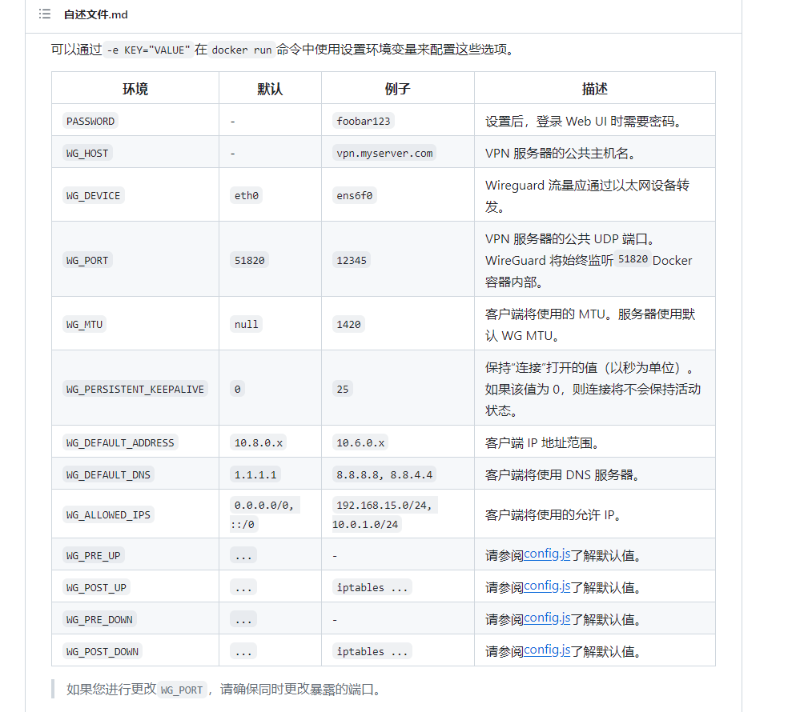

### 3、[PC端软件下载][https://download.wireguard.com/windows-client/]

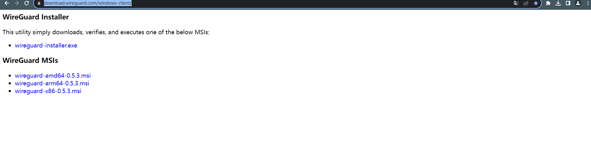

### 4、[安卓下载][https://www.wireguard.com/install/]

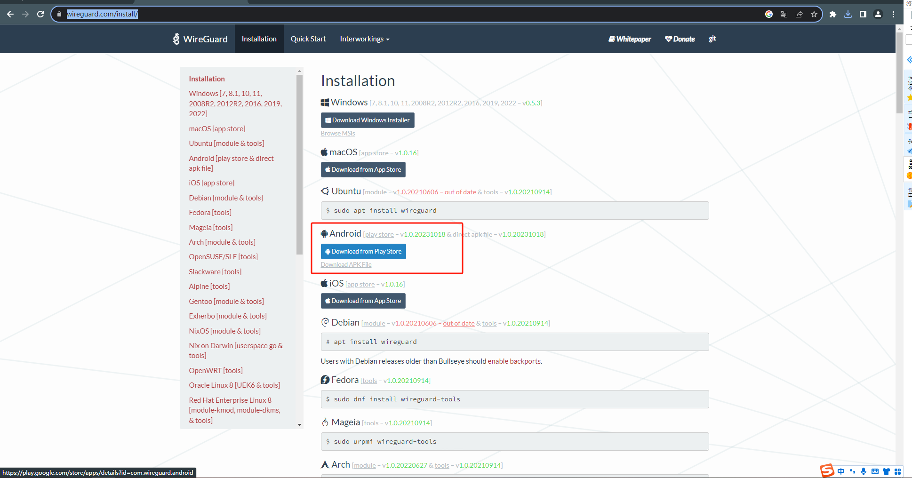

### 5、苹果手机和苹果电脑自行到苹果商店下载

### 6、容器安装

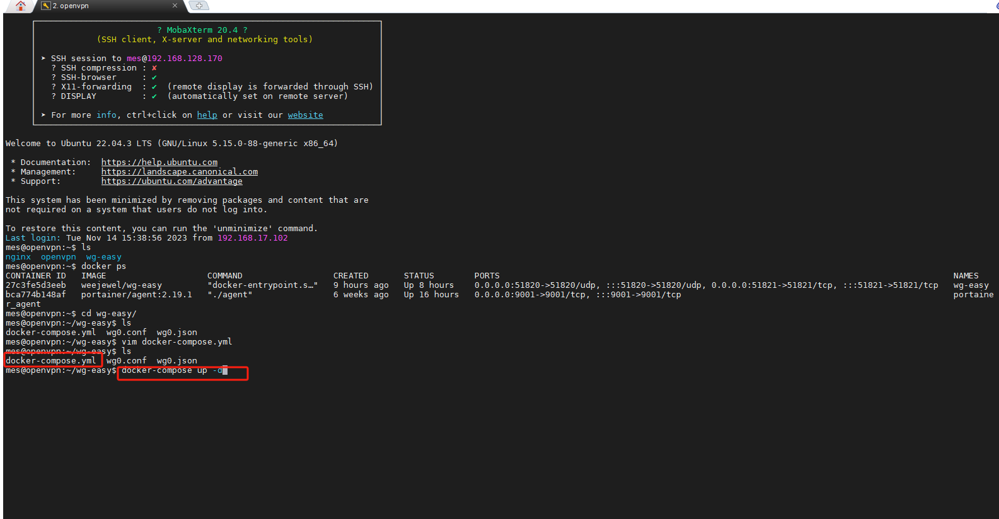

启动成功

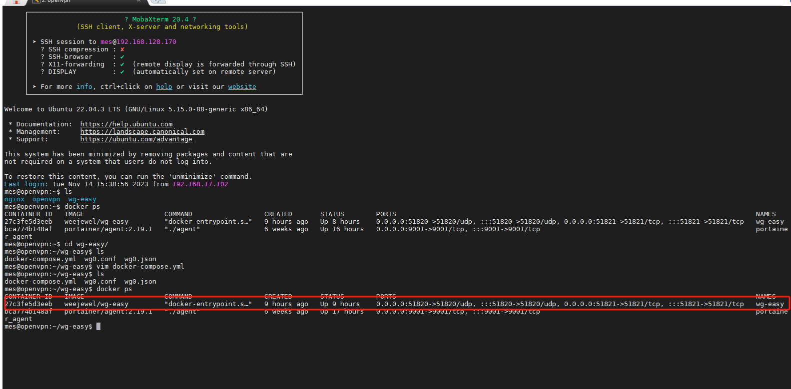

### 7、访问web端

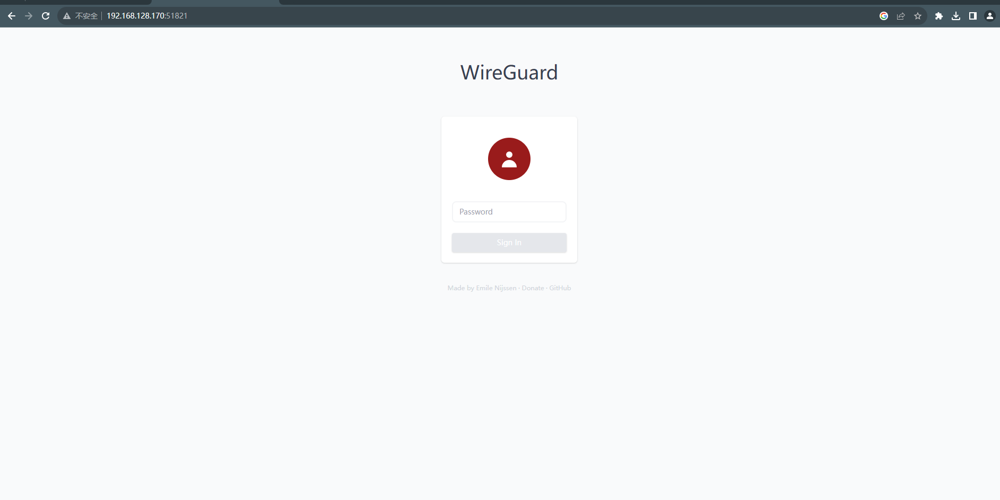

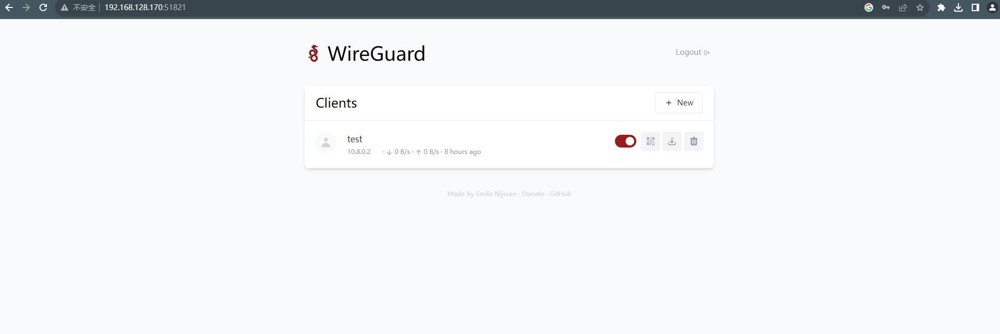

### 8、创建客户端密钥

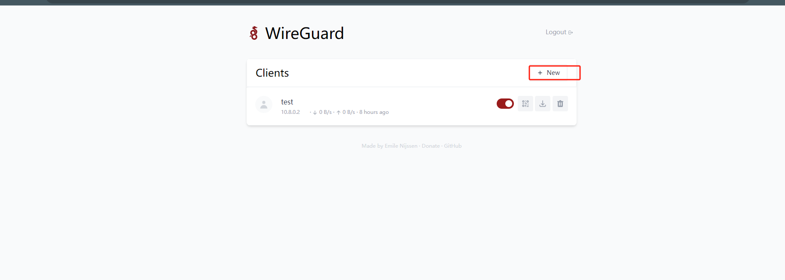

### 9、下载密钥

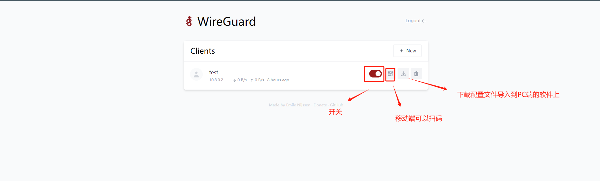

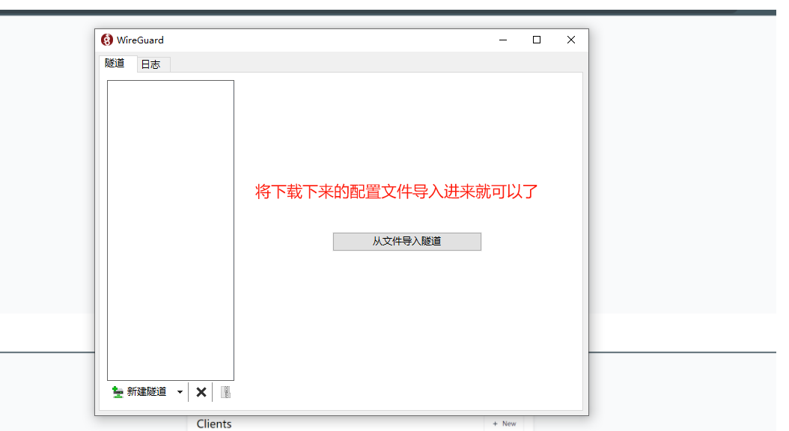
导入成功

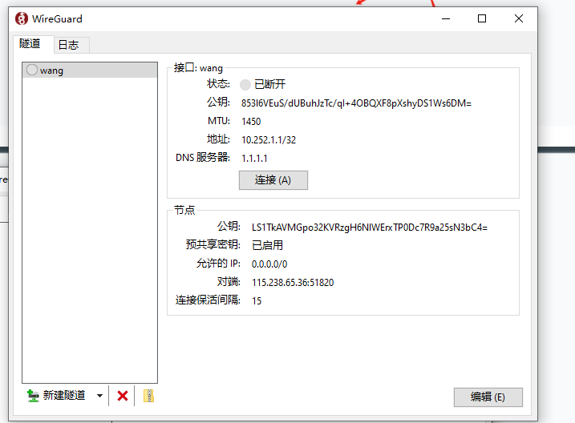


### 10、配置文件wg0.conf

```sh
# Note: Do not edit this file directly.
# Your changes will be overwritten!

# Server
[Interface]
PrivateKey = SPPs8SREpY1z1+v7CRLbDTwpqRp0L+TCvdt3qOmD1GU=
Address = 192.168.5.1/24 #这个地方记得写成你自己要分配的IP网段
ListenPort = 51820
PreUp =
PostUp =  iptables -t nat -A POSTROUTING -s 192.168.21.0/24 -o eth0 -j MASQUERADE; iptables -A INPUT -p udp -m udp --dport 51820 -j ACCEPT; iptables -A FORWARD -i wg0 -j ACCEPT; iptables -A FORWARD -o wg0 -j ACCEPT;
PreDown =
PostDown =
```

### 11、配置文件wg0.json

```json
"server": {
    "privateKey": "SPPs8SREpY1z1+v7CRLbDTwpqRp0L+TCvdt3qOmD1GU=",
    "publicKey": "BWG90hhWoiTM/9iZuBgdsX70pe/0UkN5JZFK7bpi7GQ=",
    "address": "192.168.5.1" #这个地方也改成你自己要分配的IP
  },
```

