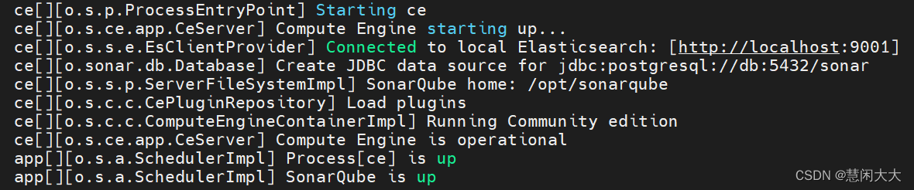
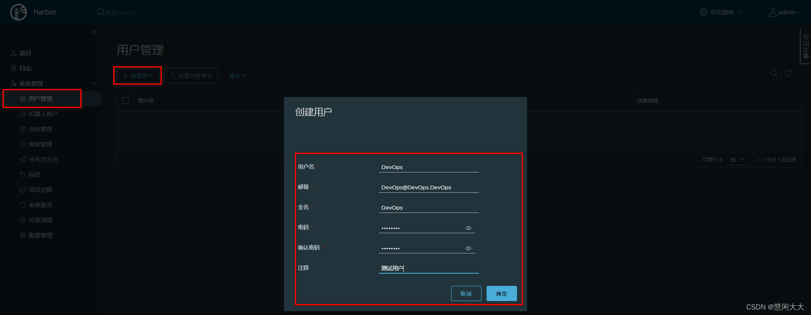

# DevOps自动化部署

## 一、软件开发过程&涉及工具


最终可以给DevOps下一个定义：DevOps 强调的是高效组织团队之间如何通过自动化的工具协作和沟通来完成软件的生命周期管理，从而更快、更频繁地交付更稳定的软件,自动化的工具协作和沟通来完成软件的生命周期管理

## 二、Code阶段工具

在code阶段，我们需要将不同版本的代码存储到一个仓库中，常见的版本控制工具就是SVN或者Git，这里我们采用Git作为版本控制工具，GitLab作为远程仓库

### 2.1、Git安装

[git官网](https://git-scm.com/)

### 2.2 GitLab安装

单独准备服务器，采用Docker安装

- 查看GitLab镜像

```sh
docker search gitlab
```

- 拉取GitLab镜像

```sh
docker pull registry.gitlab.cn/omnibus/gitlab-jh
```

- 准备docker-compose.yml文件

```yaml
version: '3'
services:
  gitlab:
    image: 'registry.gitlab.cn/omnibus/gitlab-jh'
    container_name: 'gitlab'
    restart: always
    hostname: 'gitlab' #宿主机名字
    environment:
      GITLAB_OMNIBUS_CONFIG: |
        # 设置外部URL，用于GitLab的访问地址
        external_url 'http://192.168.1.142'
        # 启用SMTP配置
        gitlab_rails['smtp_enable'] = true
        gitlab_rails['smtp_address'] = 'smtphz.qiye.163.com'  #SMTP服务器地址
        gitlab_rails['smtp_port'] = 25  #SMTP服务器端口
        gitlab_rails['smtp_user_name'] = 'binggui@dingshenggroup.com'  #SMTP帐户用户名
        gitlab_rails['smtp_password'] = '18285426,'  #SMTP帐户密码
        gitlab_rails['smtp_domain'] = 'xxxxxx'  #SMTP域
        gitlab_rails['smtp_authentication'] = 'login'  #SMTP服务器身份验证类型
        gitlab_rails['smtp_enable_starttls_auto'] = true #是否启用 STARTTLS。通常设置为 true
        gitlab_rails['smtp_tls'] = false #是否使用TLS。通常设置为 false
    ports:
      - '80:80'
      - '443:443'
      - '2222:22'
    volumes:
      - '/srv/gitlab/config:/etc/gitlab'  # GitLab配置文件
      - '/srv/gitlab/logs:/var/log/gitlab'  # GitLab日志文件
      - '/srv/gitlab/data:/var/opt/gitlab'  # GitLab数据文件
      - '/srv/gitlab/data/backups:/var/opt/gitlab/backups' #备份目录
```

- 启动

```sh
docker-compose up -d
```

- 访问GitLab首页


- 查看root用户初始密码

```sh
docker exec -it gitlab cat /etc/gitlab/initial_root_password
```


- 登录root用户


- 第一次登录后需要修改密码


搞定后，即可像Gitee、GitHub一样使用。

## 三、Build阶段工具

构建Java项目的工具一般有两种选择，一个是Maven，一个是Gradle。

这里我们选择Maven作为项目的编译工具。

具体安装Maven流程不做阐述，但是需要确保配置好Maven仓库私服以及JDK编译版本。JDK比较高的也要相应的安装高版本Maven

## 四、Operate阶段工具

部署过程，会采用Docker进行部署，暂时只安装Docker即可，后续还需安装Kubenetes

### 4.1 Docker安装

- 准备测试环境&生产环境

- 下载Docker依赖组件

```sh
yum -y install yum-utils device-mapper-persistent-data lvm2
```

- 设置下载Docker的镜像源为阿里云

```sh
yum-config-manager --add-repo http://mirrors.aliyun.com/docker-ce/linux/centos/docker-ce.repo
```

- 安装Docker服务

```sh
yum -y install docker-ce
```

- 安装成功后，启动Docker并设置开机自启

```sh
# 启动Docker服务
systemctl start docker
# 设置开机自动启动
systemctl enable docker
```

- 测试安装成功


### 4.2 Docker-Compose安装

[Docker-Compose官网](https://github.com/docker/compose)

- 将下载好的docker-compose-Linux-x86_64文件移动到Linux操作系统：……

- 设置docker-compose-Linux-x86_64文件权限，并移动到/usr/local/bin目录中

```sh
# 设置文件权限
chmod a+x docker-compose-Linux-x86_64
# 移动到/usr/bin目录下，并重命名为docker-compose
mv docker-compose-Linux-x86_64 /usr/local/bin/docker-compose
```

- 测试是否安装成功

```sh
docker-compose version
```

## 五、Integrate工具

持续集成、持续部署的工具很多，其中Jenkins是一个开源的持续集成平台。

Jenkins涉及到将编写完毕的代码发布到测试环境和生产环境的任务，并且还涉及到了构建项目等任务。

Jenkins需要大量的插件保证工作，安装成本较高，下面会基于Docker搭建Jenkins。

### 5.1 Jenkins介绍

Jenkins是一个开源软件项目，是基于Java开发的一种持续集成工具
Jenkins应用广泛，大多数互联网公司都采用Jenkins配合GitLab、Docker、K8s作为实现DevOps的核心工具。
Jenkins最强大的就在于插件，Jenkins官方提供了大量的插件库，来自动化CI/CD过程中的各种琐碎功能
Jenkins最主要的工作就是将GitLab上可以构建的工程代码拉取并且进行构建，再根据流程可以选择发布到测试环境或是生产环境。
一般是GitLab上的代码经过大量的测试后，确定发行版本，再发布到生产环境。
CI/CD可以理解为：

- CI过程即是通过Jenkins将代码拉取、构建、制作镜像交给测试人员测试。
  - 持续集成：让软件代码可以持续的集成到主干上，并自动构建和测试。
- CD过程即是通过Jenkins将打好标签的发行版本代码拉取、构建、制作镜像交给运维人员部署。
  - 持续交付：让经过持续集成的代码可以进行手动部署。
  - 持续部署：让可以持续交付的代码随时随地的自动化部署。
  
  

  ### 5.2 Jenkins安装

  - 拉取Jenkins镜像

  ```sh
  docker pull jenkins/jenkins
  ```

  - 编写docker-compose.yml

```yaml
version: '3.1'
services:
  jenkins:
    image: jenkins/jenkins:2.426.3-lts
    container_name: jenkins
    restart: always # 添加这一行，设置容器的重启策略为"always"
    ports:
      - "8080:8080"
      - "50000:50000"
    volumes:
      - /home/mes/jenkins_home:/var/jenkins_home
      - /var/run/docker.sock:/var/run/docker.sock
      - /usr/bin/docker:/usr/bin/docker
      - /etc/docker/daemon.json:/etc/docker/daemon.json
    networks:
      - jenkins-net
volumes:
  jenkins_home:
networks:
  jenkins-net:

```

- 首次启动会因为数据卷data目录没有权限导致启动失败，设置data目录写权限


```sh
chmod -R a+w data/
```

- 重新启动Jenkins容器后，由于Jenkins需要下载大量内容，但是由于默认下载地址下载速度较慢，需要重新设置下载地址为国内镜像站

```json
# 修改数据卷中的hudson.model.UpdateCenter.xml文件
<?xml version='1.1' encoding='UTF-8'?>
<sites>
  <site>
    <id>default</id>
    <url>https://updates.jenkins.io/update-center.json</url>
  </site>
</sites>
# 将下载地址替换为http://mirror.esuni.jp/jenkins/updates/update-center.json
<?xml version='1.1' encoding='UTF-8'?>
<sites>
  <site>
    <id>default</id>
    <url>http://mirror.esuni.jp/jenkins/updates/update-center.json</url>
  </site>
</sites>
# 清华大学的插件源也可以https://mirrors.tuna.tsinghua.edu.cn/jenkins/updates/update-center.json
```

- 再次重启Jenkins容器，访问Jenkins（需要稍微等会）


- 查看密码登录Jenkins，并登录下载插件

```sh
docker exec -it jenkins cat /var/jenkins_home/secrets/initialAdminPassword
```


- 选择需要安装的插件


- 下载完毕设置信息进入首页（可能会出现下载失败的插件）


### 5.3 Jenkins入门配置

由于Jenkins需要从Git拉取代码、需要本地构建、甚至需要直接发布自定义镜像到Docker仓库，所以Jenkins需要配置大量内容

### 5.3.1 构建任务

- 准备好GitLab仓库中的项目，并且通过Jenkins配置项目的实现当前项目的DevOps基本流程

- 构建Maven工程发布到GitLab（Gitee、Github均可）


- Jenkins点击左侧导航新建任务


- 选择自由风格构建任务


- Jenkins需要将Git上存放的源码存储到Jenkins服务所在磁盘的本地
  
  - 配置任务源码拉取的地址


- Jenkins立即构建


- 查看构建工程的日志，点击上述③的任务条即可


可以看到源码已经拉取带Jenkins本地，可以根据第三行日志信息，查看Jenkins本地拉取到的源码。

- 查看Jenkins容器中/var/jenkins_home/workspace/test的源码


### 5.3.2 配置Maven构建代码

代码拉取到Jenkins本地后，需要在Jenkins中对代码进行构建，这里需要Maven的环境，而Maven需要Java的环境，接下来需要在Jenkins中安装JDK和Maven，并且配置到Jenkins服务。

- 准备JDK、Maven压缩包通过数据卷映射到Jenkins容器内部


- 解压压缩包，并配置Maven的settings.xml

```xml
<!-- 阿里云镜像地址 -->
<mirror>  
    <id>alimaven</id>  
    <name>aliyun maven</name>  
    <url>http://maven.aliyun.com/nexus/content/groups/public/</url>
    <mirrorOf>central</mirrorOf>          
</mirror>
<!-- JDK1.8编译插件 -->
<profile>
    <id>jdk-1.8</id>
    <activation>
        <activeByDefault>true</activeByDefault>
        <jdk>1.8</jdk>
    </activation>
    <properties>
        <maven.compiler.source>1.8</maven.compiler.source>
        <maven.compiler.target>1.8</maven.compiler.target>
        <maven.compiler.compilerVersion>1.8</maven.compiler.compilerVersion>
    </properties>        
</profile>
```

- Jenkins配置JDK&Maven并保存


- 配置Jenkins任务构建代码


- 立即构建测试，查看target下的jar包


### 5.3.3 配置Publish发布&远程操作

jar包构建好之后，就可以根据情况发布到测试或生产环境，这里需要用到之前下载好的插件Publish Over SSH。

- 配置Publish Over SSH连接测试、生产环境


- 配置任务的构建后操作，发布jar包到目标服务


- 立即构建任务，并去目标服务查看


## 六、CI、CD入门操作

基于Jenkins拉取GitLab的SpringBoot代码进行构建发布到测试环境实现持续集成

基于Jenkins拉取GitLab指定发行版本的SpringBoot代码进行构建发布到生产环境实现CD实现持续部署

### 6.1 持续集成

为了让程序代码可以自动推送到测试环境基于Docker服务运行，需要添加Docker配置和脚本文件让程序可以在集成到主干的同时运行起来。

- 添加Dockerfile文件

```Dockerfile
FROM eclipse-temurin:21-jre

## 创建目录，并使用它作为工作目录
RUN mkdir -p /yudao-server
WORKDIR /yudao-server
## 将后端项目的 Jar 文件，复制到镜像中
COPY ./target/yudao-server.jar app.jar

## 设置 TZ 时区
ENV TZ=Asia/Shanghai
## 设置 JAVA_OPTS 环境变量，可通过 docker run -e "JAVA_OPTS=" 进行覆盖
ENV JAVA_OPTS="-Xms512m -Xmx512m -Djava.security.egd=file:/dev/./urandom"

## 应用参数
ENV ARGS=""

## 暴露后端项目的 48080 端口
EXPOSE 8080

## 启动后端项目
CMD java ${JAVA_OPTS} -jar app.jar $ARGS
```

- 添加docker-compose.yml文件


- 追加Jenkins构建后操作脚本命令


- 发布到GitLab后由Jenkins立即构建并托送到目标服务器


- 测试部署到目标服务器程序


### 6.2 持续交付、部署

程序代码在经过多次集成操作到达最终可以交付，持续交付整体流程和持续集成类似，不过需要选取指定的发行版本

- 下载Git Parameter插件


- 设置项目参数化构建


- 给项目添加tag版本


- 任务构建时，采用Shell方式构建，拉取指定tag版本代码


- 基于Parameter构建任务，任务发布到目标服务器


## 七、集成Sonar Qube

### 7.1 Sonar Qube介绍

- Sonar Qube是一个开源的代码分析平台，支持Java、Python、PHP、JavaScript、CSS等25种以上的语言，可以检测出重复代码、代码漏洞、代码规范和安全性漏洞的问题。

- Sonar Qube可以与多种软件整合进行代码扫描，比如Maven，Gradle，Git，Jenkins等，并且会将代码检测结果推送回Sonar Qube并且在系统提供的UI界面上显示出来


### 7.2 Sonar Qube环境搭建

### 7.2.1 Sonar Qube安装

Sonar Qube在7.9版本中已经放弃了对MySQL的支持，并且建议在商业环境中采用PostgreSQL，那么安装Sonar Qube时需要依赖PostgreSQL。
并且这里会安装Sonar Qube的长期支持版本

```sh
docker pull postgres
docker pull sonarqube
```

- 编写docker-compoe.yml

```yaml
version: "3.1"
services:
  db:
    image: postgres
    container_name: db
    ports:
      - 5432:5432
    networks:
      - sonarnet
    environment:
      POSTGRES_USER: sonar
      POSTGRES_PASSWORD: sonar
  sonarqube:
    image: sonarqube:9.9.6-community
    container_name: sonarqube
    depends_on:
      - db
    ports:
      - "9000:9000"
    networks:
      - sonarnet
    environment:
      SONAR_JDBC_URL: jdbc:postgresql://db:5432/sonar
      SONAR_JDBC_USERNAME: sonar
      SONAR_JDBC_PASSWORD: sonar
networks:
  sonarnet:
    driver: bridge
```

- 启动容器

```sh
docker-compose up -d
```

- 需要设置sysctl.conf文件信息


- 并执行命令刷新

```sh
sysctl -p
```

- 重新启动需要一定时间启动，可以可以查看容器日志，看到如下内容代表启动成功



- 访问Sonar Qube首页


- 还需要重新设置一次密码


- Sonar Qube首页


#### 7.2.2 安装中文插件


安装成功后需要重启，安装失败重新点击install重装即可。
安装成功后，会查看到重启按钮，点击即可


- 重启后查看效果


### 7.3 Sonar Qube基本使用

Sonar Qube的使用方式很多，Maven可以整合，也可以采用sonar-scanner的方式，再查看Sonar Qube的检测效果

#### 7.3.1 Maven实现代码检测

- 修改Maven的settings.xml文件配置Sonar Qube信息
  
```xml
  <profile>
    <id>sonar</id>
    <activation>
        <activeByDefault>true</activeByDefault>
    </activation>
    <properties>
        <sonar.login>admin</sonar.login>
        <sonar.password>123456789</sonar.password>
        <sonar.host.url>http://192.168.11.11:9000</sonar.host.url>
    </properties>

</profile>
```

- 在代码位置执行命令：mvn sonar:sonar


- 查看Sonar Qube界面检测结果


- 7.3.2 Sonar-scanner实现代码检测

[Sonar-scanner官网](https://binaries.sonarsource.com/Distribution/sonar-scanner-cli/)
  下载4.6.x版本即可，要求Linux版本
 解压并配置sonar服务端信息
 由于是zip压缩包，需要安装unzip解压插件
  
```sh
  yum -y install unzip
```

- 解压压缩包

 ```sh
  unzip sonar-scanner-cli/sonar-scanner-cli-4.6.0.2311-linux.zip
 ```

- 配置sonarQube服务端地址，修改conf下的sonar-scanner.properties


- 执行命令检测代码

```sh
# 在项目所在目录执行以下命令
~/sonar-scanner/bin/sonar-scanner -Dsonar.sources=./ -Dsonar.projectname=demo -Dsonar.projectKey=java -Dsonar.java.binaries=target/
```

- 查看SonarQube界面检测结果


### 7.4 Jenkins集成Sonar Qube

Jenkins继承Sonar Qube实现代码扫描需要先下载整合插件

#### 7.4.1 Jenkins安装插件


### 7.4.2 Jenkins配置Sonar Qube

- 开启Sonar Qube权限验证


- 获取Sonar Qube的令牌


- 配置Jenkins的Sonar Qube信息


### 7.4.3 配置Sonar-scanner

- 将Sonar-scaner添加到Jenkins数据卷中并配置全局配置


- 配置任务的Sonar-scanner


### 7.4.4 构建任务


## 八、集成Harbor

### 8.1 Harbor介绍

前面在部署项目时，我们主要采用Jenkins推送jar包到指定服务器，再通过脚本命令让目标服务器对当前jar进行部署，这种方式在项目较多时，每个目标服务器都需要将jar包制作成自定义镜像再通过docker进行启动，重复操作比较多，会降低项目部署时间。

我们可以通过Harbor作为私有的Docker镜像仓库。让Jenkins统一将项目打包并制作成Docker镜像发布到Harbor仓库中，只需要通知目标服务，让目标服务统一去Harbor仓库上拉取镜像并在本地部署即可。

Docker官方提供了Registry镜像仓库，但是Registry的功能相对简陋。Harbor是VMware公司提供的一款镜像仓库，提供了权限控制、分布式发布、强大的安全扫描与审查机制等功能

### 8.2 Harbor安装

这里采用原生的方式安装Harbor。

[下载地址](https://github.com/goharbor/harbor)

- 拖拽到Linux并解压

```sh
tar -zxvf harbor-offline-installer-v2.11.1.tgz -C /usr/local/
```

- 修改Harbor配置文件

- 首先复制一份harbor.yml配置

```sh
cp harbor.yml.tmpl harbor.yml
```

- 编辑harbor.yml配置文件


- 启动Harbor

```sh
./install.sh
```


- 登录Harbor


- 首页信息


### 8.3 Harbor使用方式

Harbor作为镜像仓库，主要的交互方式就是将镜像上传到Harbor上，以及从Harbor上下载指定镜像

在传输镜像前，可以先使用Harbor提供的权限管理，将项目设置为私有项目，并对不同用户设置不同角色，从而更方便管理镜像。

### 8.3.1 添加用户构建项目

- 创建用户



- 构建项目（设置为私有）


- 给项目追加用户


- 切换测试用户


### 8.3.2 发布镜像到Harbor

- 修改镜像名称

名称要求：harbor地址/项目名/镜像名:版本


- 修改daemon.json，支持Docker仓库，并重启Docker


- 设置登录仓库信息

```sh
docker login -u 用户名 -p 密码 Harbor地址
```

- 推送镜像到Harbor


### 8.3.3 从Harbor拉取镜像ls

- 跟传统方式一样，不过需要先配置/etc/docker/daemon.json文件

```json
{
        "registry-mirrors": ["https://pee6w651.mirror.aliyuncs.com"],
        "insecure-registries": ["192.168.11.11:80"]
}
```


### 8.3.4 Jenkins容器使用宿主机Docker

构建镜像和发布镜像到harbor都需要使用到docker命令。而在Jenkins容器内部安装Docker官方推荐直接采用宿主机带的Docker即可。

设置Jenkins容器使用宿主机Docker

- 设置宿主机docker.sock权限：

```sh
sudo chown root:root /var/run/docker.sock
sudo chmod o+rw /var/run/docker.sock
```

### 8.3.5 添加构建操作


### 8.3.6 编写部署脚本

- 编写脚本文件，添加到目标服务器

```sh
harbor_url=$1
harbor_project_name=$2
project_name=$3
tag=$4
port=$5

imageName=$harbor_url/$harbor_project_name/$project_name:$tag

containerId=`docker ps -a | grep ${project_name} | awk '{print $1}'`
if [ "$containerId" != "" ] ; then
    docker stop $containerId
    docker rm $containerId
    echo "Delete Container Success"
fi

imageId=`docker images | grep ${project_name} | awk '{print $3}'`

if [ "$imageId" != "" ] ; then
    docker rmi -f $imageId
    echo "Delete Image Success"
fi

docker login -u DevOps -p P@ssw0rd $harbor_url

docker pull $imageName

docker run -d -p $port:$port --name $project_name $imageName

echo "Start Container Success"
echo $project_name
```

- 并设置权限为可执行

```sh
chmod a+x deploy.sh
```


### 8.3.7 配置构建后操作


## 九、Jenkins流水线

### 9.1 Jenkins流水线任务介绍

之前采用Jenkins的自由风格构建的项目，每个步骤流程都要通过不同的方式设置，并且构建过程中整体流程是不可见的，无法确认每个流程花费的时间，并且问题不方便定位问题。

Jenkins的Pipeline可以让项目的发布整体流程可视化，明确执行的阶段，可以快速的定位问题。并且整个项目的生命周期可以通过一个Jenkinsfile文件管理，而且Jenkinsfile文件是可以放在项目中维护。

所以Pipeline相对自由风格或者其他的项目风格更容易操作。

### 9.2 Jenkins流水线任务

### 9.2.1 构建Jenkins流水线任务

- 构建任务


- 生成Groovy脚本


- 构建后查看视图


### 9.2.2 Groovy脚本

- Groovy脚本基础语法

```Groovy
// 所有脚本命令包含在pipeline{}中
pipeline {  
// 指定任务在哪个节点执行（Jenkins支持分布式）
    agent any
    
    // 配置全局环境，指定变量名=变量值信息
    environment{
      host = '192.168.11.11'
    }

    // 存放所有任务的合集
    stages {
    // 单个任务
        stage('任务1') {
        // 实现任务的具体流程
            steps {
                echo 'do something'
            }
        }
// 单个任务
        stage('任务2') {
       // 实现任务的具体流程
            steps {
                echo 'do something'
            }
        }
        // ……
    }
}
```

- 编写例子测试

```Groovy
pipeline {
    agent any

    // 存放所有任务的合集
    stages {
        stage('拉取Git代码') {
            steps {
                echo '拉取Git代码'
            }
        }

        stage('检测代码质量') {
            steps {
                echo '检测代码质量'
            }
        }

        stage('构建代码') {
            steps {
                echo '构建代码'
            }
        }

        stage('制作自定义镜像并发布Harbor') {
            steps {
                echo '制作自定义镜像并发布Harbor'
            }
        }

        stage('基于Harbor部署工程') {
            steps {
                echo '基于Harbor部署工程'
            }
        }
    }
}
```


- 查看效果


- 涉及到特定脚本，Jenkins给予了充足的提示，可以自动生成命令


### 9.2.3 Jenkinsfile实现

Jenkinsfile方式需要将脚本内容编写到项目中的Jenkinsfile文件中，每次构建会自动拉取项目并且获取项目中Jenkinsfile文件对项目进行构建

- 配置pipeline


- 准备Jenkinsfile


- 测试效果


### 9.3 Jenkins流水线任务实现

### 9.3.1 参数化构建

添加参数化构建，方便选择不的项目版本


### 9.3.2 拉取Git代码

通过流水线语法生成Checkout代码的脚本


- 将*/master更改为标签${tag}

```Groovy
pipeline {
    agent any
    stages {

        stage('拉取Git代码') {
            steps {
                checkout([$class: 'GitSCM', branches: [[name: '${tag}']], extensions: [], userRemoteConfigs: [[url: 'http://49.233.115.171:8929/root/test.git']]])
            }
        }
    }
}
```

### 9.3.3 构建代码

通过脚本执行mvn的构建命令

```Groovy
pipeline {
    agent any

    stages {

        stage('拉取Git代码') {
            steps {
                checkout([$class: 'GitSCM', branches: [[name: '${tag}']], extensions: [], userRemoteConfigs: [[url: 'http://49.233.115.171:8929/root/test.git']]])
            }
        }

        stage('构建代码') {
            steps {
                sh '/var/jenkins_home/maven/bin/mvn clean package -DskipTests'
            }
        }
}
```

### 9.3.4 代码质量检测

- 通过脚本执行sonar-scanner命令即可

```Groovy
pipeline {
    agent any

    stages {

        stage('拉取Git代码') {
            steps {
                checkout([$class: 'GitSCM', branches: [[name: '${tag}']], extensions: [], userRemoteConfigs: [[url: 'http://49.233.115.171:8929/root/test.git']]])
            }
        }

        stage('构建代码') {
            steps {
                sh '/var/jenkins_home/maven/bin/mvn clean package -DskipTests'
            }
        }

        stage('检测代码质量') {
            steps {
                sh '/var/jenkins_home/sonar-scanner/bin/sonar-scanner -Dsonar.sources=./ -Dsonar.projectname=${JOB_NAME} -Dsonar.projectKey=${JOB_NAME} -Dsonar.java.binaries=target/ -Dsonar.login=31388be45653876c1f51ec02f0d478e2d9d0e1fa' 
            }
        }
    }
}
```

### 9.3.5 制作自定义镜像并发布

- 生成自定义镜像脚本

```Groovy
pipeline {
    agent any
    environment{
        harborHost = '192.168.11.11:80'
        harborRepo = 'repository'
        harborUser = 'DevOps'
        harborPasswd = 'P@ssw0rd'
    }

    // 存放所有任务的合集
    stages {

        stage('拉取Git代码') {
            steps {
                checkout([$class: 'GitSCM', branches: [[name: '${tag}']], extensions: [], userRemoteConfigs: [[url: 'http://49.233.115.171:8929/root/test.git']]])
            }
        }

        stage('构建代码') {
            steps {
                sh '/var/jenkins_home/maven/bin/mvn clean package -DskipTests'
            }
        }

        stage('检测代码质量') {
            steps {
                sh '/var/jenkins_home/sonar-scanner/bin/sonar-scanner -Dsonar.sources=./ -Dsonar.projectname=${JOB_NAME} -Dsonar.projectKey=${JOB_NAME} -Dsonar.java.binaries=target/ -Dsonar.login=31388be45653876c1f51ec02f0d478e2d9d0e1fa' 
            }
        }

        stage('制作自定义镜像并发布Harbor') {
            steps {
                sh '''cp ./target/*.jar ./docker/
                cd ./docker
                docker build -t ${JOB_NAME}:${tag} ./'''

                sh '''docker login -u ${harborUser} -p ${harborPasswd} ${harborHost}
                docker tag ${JOB_NAME}:${tag} ${harborHost}/${harborRepo}/${JOB_NAME}:${tag}
                docker push ${harborHost}/${harborRepo}/${JOB_NAME}:${tag}'''
            }
        }
    }
}
```

- 生成Publish Over SSH脚本

```Groovy
pipeline {
    agent any
    environment{
        harborHost = '192.168.11.11:80'
        harborRepo = 'repository'
        harborUser = 'DevOps'
        harborPasswd = 'P@ssw0rd'
    }

    // 存放所有任务的合集
    stages {

        stage('拉取Git代码') {
            steps {
                checkout([$class: 'GitSCM', branches: [[name: '${tag}']], extensions: [], userRemoteConfigs: [[url: 'http://49.233.115.171:8929/root/test.git']]])
            }
        }

        stage('构建代码') {
            steps {
                sh '/var/jenkins_home/maven/bin/mvn clean package -DskipTests'
            }
        }docker

        stage('检测代码质量') {
            steps {
                sh '/var/jenkins_home/sonar-scanner/bin/sonar-scanner -Dsonar.sources=./ -Dsonar.projectname=${JOB_NAME} -Dsonar.projectKey=${JOB_NAME} -Dsonar.java.binaries=target/ -Dsonar.login=7d66af4b39cfe4f52ac0a915d4c9d5c513207098' 
            }
        }

        stage('制作自定义镜像并发布Harbor') {
            steps {
                sh '''cp ./target/*.jar ./docker/
                cd ./docker
                docker build -t ${JOB_NAME}:${tag} ./'''

                sh '''docker login -u ${harborUser} -p ${harborPasswd} ${harborHost}
                docker tag ${JOB_NAME}:${tag} ${harborHost}/${harborRepo}/${JOB_NAME}:${tag}
                docker push ${harborHost}/${harborRepo}/${JOB_NAME}:${tag}'''
            }
        }
        
        stage('目标服务器拉取镜像并运行') {
            steps {
                sshPublisher(publishers: [sshPublisherDesc(configName: 'testEnvironment', transfers: [sshTransfer(cleanRemote: false, excludes: '', execCommand: "/usr/bin/deploy.sh $harborHost $harborRepo $JOB_NAME $tag $port ", execTimeout: 120000, flatten: false, makeEmptyDirs: false, noDefaultExcludes: false, patternSeparator: '[, ]+', remoteDirectory: '', remoteDirectorySDF: false, removePrefix: '', sourceFiles: '')], usePromotionTimestamp: false, useWorkspaceInPromotion: false, verbose: false)])
            }
        }
    }
}
```

- 由于采用变量，记得使用双引号

### 9.4 Jenkins流水线整合钉钉

在程序部署成功后，可以通过钉钉的机器人及时向群众发送部署的最终结果通知

- 安装插件


- 钉钉内部创建群组并构建机器人


- 最终或获取到Webhook信息

```sh
https://oapi.dingtalk.com/robot/send?access_token=kej4ehkj34gjhg34jh5bh5jb34hj53b4
```

- 系统配置添加钉钉通知

- 任务中追加流水线配置

```Groovy
pipeline {
    agent any

    environment {
        sonarLogin = '2bab7bf7d5af25e2c2ca2f178af2c3c55c64d5d8'
        harborUser = 'admin'
        harborPassword = 'Harbor12345'
        harborHost = '192.168.11.12:8888'
        harborRepo = 'repository'
    }

    stages {
        stage('拉取Git代码'){
            steps {
                checkout([$class: 'GitSCM', branches: [[name: '$tag']], extensions: [], userRemoteConfigs: [[url: 'http://49.233.115.171:8929/root/lsx.git']]])
            }
        }
        stage('Maven构建代码'){
            steps {
                sh '/var/jenkins_home/maven/bin/mvn clean package -DskipTests'
            }
        }
        stage('SonarQube检测代码'){
            steps {
                sh '/var/jenkins_home/sonar-scanner/bin/sonar-scanner -Dsonar.sources=./ -Dsonar.projectname=${JOB_NAME} -Dsonar.projectKey=${JOB_NAME} -Dsonar.java.binaries=target/ -Dsonar.login=${sonarLogin}'
            }
        }
        stage('制作自定义镜像'){
            steps {
                sh '''cd docker
                mv ../target/*.jar ./
                docker build -t ${JOB_NAME}:$tag .
                '''
            }
        }

        stage('推送自定义镜像'){
            steps {
                sh '''docker login -u ${harborUser} -p ${harborPassword} ${harborHost}
                docker tag ${JOB_NAME}:$tag ${harborHost}/${harborRepo}/${JOB_NAME}:$tag
                docker push ${harborHost}/${harborRepo}/${JOB_NAME}:$tag'''
            }
        }

        stage('通知目标服务器'){
            steps {
                sshPublisher(publishers: [sshPublisherDesc(configName: 'centos-docker', transfers: [sshTransfer(cleanRemote: false, excludes: '', execCommand: "/usr/bin/deploy.sh $harborHost $harborRepo $JOB_NAME $tag $port", execTimeout: 120000, flatten: false, makeEmptyDirs: false, noDefaultExcludes: false, patternSeparator: '[, ]+', remoteDirectory: '', remoteDirectorySDF: false, removePrefix: '', sourceFiles: '')], usePromotionTimestamp: false, useWorkspaceInPromotion: false, verbose: false)])
            }  
        }
    }
    post {
        success {
            dingtalk (
                robot: 'Jenkins-DingDing',
                type:'MARKDOWN',
                title: "success: ${JOB_NAME}",
                text: ["- 成功构建:${JOB_NAME}项目!\n- 版本:${tag}\n- 持续时间:${currentBuild.durationString}\n- 任务:#${JOB_NAME}"]
            )
        }
        failure {
            dingtalk (
                robot: 'Jenkins-DingDing',
                type:'MARKDOWN',
                title: "fail: ${JOB_NAME}",
                text: ["- 失败构建:${JOB_NAME}项目!\n- 版本:${tag}\n- 持续时间:${currentBuild.durationString}\n- 任务:#${JOB_NAME}"]
            )
        }
    }
}
```

- 查看效果

